# O autômato `ac_automaton_t`

O autômato Aho–Corasick deste laboratório é construído **uma vez,
sequencialmente, pelo master thread**, e a partir daí é tratado como
**uma estrutura imutável compartilhada por ponteiro** entre todas as
threads da fase de busca.

Esta página descreve:

1. O layout em memória.
2. O algoritmo de construção (trie → função de transição plana → falha → `dict_suffix`).
3. As decisões de design (e por que cada uma importa para o paralelismo).

Fonte: [`include/ac_automaton.h`](../../include/ac_automaton.h),
[`src/ac_automaton.c`](../../src/ac_automaton.c).

## Layout em memória

```c
typedef struct ac_automaton {
    int32_t          *goto_tbl;       // [num_states * 256]
    int32_t           num_states;

    int32_t          *own_out_head;   // [num_states]
    int32_t          *dict_suffix;    // [num_states]

    ac_output_entry_t *outputs;       // arena de pares (pattern_id, next)
    int32_t            num_outputs;

    ac_pattern_t      *patterns;      // dicionário (cópias dos textos)
    int32_t            num_patterns;

    int32_t            max_pattern_len;
    int32_t            min_pattern_len;
} ac_automaton_t;
```

### `goto_tbl[state * 256 + byte]`

Tabela **densa** com a função de transição determinística — Aho–Corasick
no formato DFA. Cada passo da varredura custa **uma carga indexada**:

```c
state = goto_tbl[(size_t)state * 256 + c];
```

A escolha por `int32_t[]` plano (em vez de map / hashtable / ponteiros)
é deliberada:

- **Linearidade no acesso**: estados próximos no índice ficam próximos
  na memória.
- **Tamanho previsível**: para `S` estados, são `S * 256 * 4` bytes
  = `S` KiB. Permite avaliar facilmente se o autômato cabe em L2/L3.
- **Compartilhamento sem locks**: como é puramente leitura após o
  build, múltiplas threads podem caminhar pelo array sem qualquer
  sincronização.

### `own_out_head[state]` + `outputs[]`

Cada estado pode ser **terminal** para zero, um ou múltiplos padrões
(diferentes padrões podem terminar no mesmo nó da trie). Os
`pattern_id`s formam uma lista ligada por índice, armazenada em uma
arena contígua `outputs[]`:

```c
int32_t l = own_out_head[state];
while (l != AC_NIL) {
    int32_t pid = outputs[l].pattern_id;
    /* ... emite match ... */
    l = outputs[l].next;
}
```

Como tudo é índice (não ponteiro), a arena é facilmente realocável
durante o build, e depois é compartilhada read-only sem ajustes.

### `dict_suffix[state]`

Aponta para o ancestral mais próximo na cadeia de **falha** que tem
saídas próprias (`own_out_head[anc] != AC_NIL`). Se nenhum existe,
`AC_NIL`. É o que permite emitir todos os padrões que terminam em uma
posição em **O(1)** + **O(quantidade emitida)** por byte, em vez de
caminhar pela cadeia de fail caractere a caractere.

### `patterns[]`

Cópias dos textos dos padrões (com tamanho), usadas apenas para imprimir
matches bonitos no CLI. Não é tocado no loop quente.

## Construção

A construção é dividida em duas etapas, ambas single-thread.

### Etapa 1: inserção na trie

Para cada padrão, percorre os bytes e segue / cria nós em uma trie
representada por `b.raw_child` (tabela auxiliar usada apenas no build).
Ao chegar no fim do padrão, adiciona uma entrada em `own_out_head`
para o estado terminal.

```mermaid
flowchart TD
    A[Padrão p] --> B[state = 0]
    B --> C{para cada byte c em p}
    C --> D{raw_child&#91;state*256+c&#93;<br/>existe?}
    D -- não --> E[aloca novo estado ns,<br/>raw_child&#91;state*256+c&#93; = ns]
    D -- sim --> F[state = filho existente]
    E --> F
    F --> C
    C -- fim --> G[push_output(state, pattern_id)]
```

### Etapa 2: BFS para `fail` + `goto_tbl` + `dict_suffix`

Em **uma única BFS a partir da raiz**, três coisas acontecem em
paralelo:

1. A linha da raiz (`goto_tbl[0..256)`) é preenchida com transições
   reais para filhos, ou auto-loop para a raiz quando o byte não
   começa nenhum padrão.
2. Para cada estado `u` desenfileirado, com pai `p` alcançado por byte
   `c`: para cada byte `c'`, ou `u` tem filho real `v` (e
   `goto_tbl[u, c'] = v`, `fail[v] = goto_tbl[fail[u], c']`), ou
   `goto_tbl[u, c'] = goto_tbl[fail[u], c']`. Como BFS garante que
   `fail[u]` é processado antes de `u`, esse acesso é sempre válido.
3. `dict_suffix[u]` é definido logo que `fail[u]` é conhecido: se
   `own_out_head[fail[u]] != AC_NIL`, então `dict_suffix[u] = fail[u]`;
   senão `dict_suffix[u] = dict_suffix[fail[u]]`.

```mermaid
flowchart TD
    Init[Inicializa fila com filhos da raiz<br/>fail&#91;v&#93; = 0] --> Pop{fila vazia?}
    Pop -- sim --> Fim[goto_tbl + dict_suffix prontos]
    Pop -- não --> Take[u = dequeue]
    Take --> SetDict{own_out_head&#91;fail&#91;u&#93;&#93; != NIL?}
    SetDict -- sim --> DS1[dict_suffix&#91;u&#93; = fail&#91;u&#93;]
    SetDict -- não --> DS2[dict_suffix&#91;u&#93; = dict_suffix&#91;fail&#91;u&#93;&#93;]
    DS1 --> ForC[para cada byte c]
    DS2 --> ForC
    ForC --> Has{raw_child&#91;u,c&#93; existe?}
    Has -- não --> Inherit[goto_tbl&#91;u,c&#93; = goto_tbl&#91;fail&#91;u&#93;,c&#93;]
    Has -- sim --> Real[goto_tbl&#91;u,c&#93; = v<br/>fail&#91;v&#93; = goto_tbl&#91;fail&#91;u&#93;,c&#93;<br/>enqueue v]
    Inherit --> Pop
    Real --> Pop
```



Ao final, o scaffold (`raw_child`, `fail`) é liberado. Resta apenas:

- `goto_tbl`, `own_out_head`, `dict_suffix` (todos read-only).
- `outputs` (read-only).
- `patterns` (read-only).

## Custo da construção

Para `M` padrões com `L` caracteres no total e alfabeto fixo
de tamanho `Σ = 256`:

- Tempo: `O(L · Σ)` — domina o preenchimento da tabela densa.
- Memória de pico: `O(S · Σ)`, onde `S` é o número de estados.

Esses números são impressos pelo CLI no início de cada execução
(`# automaton: N states, K KiB`).

## Por que esse design é amigável para paralelismo

- **Imutável após o build**: todo o estado da fase paralela mora em
  `worker_t`, nunca no autômato. Sem locks. Sem atomics. Sem
  invalidação de cache cross-thread sobre os mesmos endereços
  (compartilhamento puramente de leitura é benigno).
- **Layout denso de `goto_tbl`**: o caminho quente é uma única carga
  indexada. Cache-friendly, vetorizável, comportamento previsível.
- **Saídas via `dict_suffix`**: a parte de emissão é **rara** (a
  maioria dos estados não emite). Marcado com `AC_UNLIKELY`, o branch
  raramente se materializa no hot loop. Quando se materializa, sobe-se
  pela cadeia de `dict_suffix` (saltos largos) em vez de fail
  (saltos pequenos).
- **Tudo indexado por inteiros**: o autômato é trivialmente
  *serializável* se um dia for útil (cache em disco, mmap binário,
  comparação de versões).

## Sanity checks

- `ac_automaton_memory_bytes(aut)` é a forma canônica de medir o
  footprint do autômato (incluindo arena de outputs e cópias de
  padrões). Reporte sempre junto com `num_states` ao discutir
  configurações de benchmark.
- `aut->max_pattern_len` é a fonte da verdade para calcular o overlap
  em qualquer searcher chunked. **Não** assuma valores baseados em
  inspeção visual dos padrões.

## Onde isso aparece nos searchers

- [`../searchers/sequential.md`](../searchers/sequential.md) — usa
  `goto_tbl` + `own_out_head` + `dict_suffix` exatamente como
  descrito acima, em uma única thread.
- [`../searchers/pthread_chunked.md`](../searchers/pthread_chunked.md)
  — usa as **mesmas** estruturas em paralelo, sem qualquer
  modificação, e estabelece `overlap = aut->max_pattern_len - 1` a
  partir do campo cacheado.
