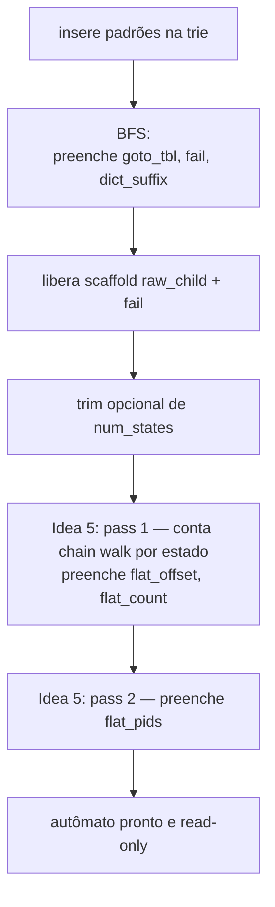

# Flat output table (idea 5)

Página de arquitetura dedicada à transformação de layout introduzida
pela idea 5 do laboratório. Descreve **o que o pass extra de
construção monta**, **por que ele é seguro de
compartilhar** e **como searchers devem ler a nova arena**.

## Motivação em uma frase

Substituir as duas cadeias ligadas (`own_out_head` ↔ `outputs` ↔
`dict_suffix`) que o hot loop precisa percorrer em cada match por
**uma única tabela contígua** de `pattern_id`s por estado, eliminando
dois níveis de pointer-chasing dependente em troca de uma pequena
varredura `O(num_outputs)` no final do build.

## Campos novos em `ac_automaton_t`

```c
typedef struct ac_automaton {
    /* ...campos antigos preservados (own_out_head, dict_suffix,
     * outputs, ...): chain-walk searchers continuam funcionando
     * sem mudança... */

    int32_t *flat_offset;     /* [num_states] */
    int32_t *flat_count;      /* [num_states] */
    int32_t *flat_pids;       /* [total_flat_pids] */
    int32_t  total_flat_pids;
} ac_automaton_t;
```

Convidiência semântica:

```
flat_pids[ flat_offset[s] .. flat_offset[s] + flat_count[s] )
  == { pid emitido por AC sequencial ao chegar em s }
```

A ordem dentro de cada janela é canônica:

1. **Próprias saídas** do estado `s` (cadeia `own_out_head[s]`, na
   ordem de percorrer `outputs[o].next` partindo da cabeça).
2. **Ancestrais por `dict_suffix`**: para cada `l = dict_suffix(s)`,
   `dict_suffix(dict_suffix(s))`, ..., até NIL, emite a cadeia
   `own_out_head[l]` em ordem.

Como o multiset e a ordem são idênticos ao chain walk, **a lista de
matches após `ac_match_list_sort` é bit-equivalente** ao
`sequential`.

## Quando é montado

No fim de `ac_automaton_build()`, **depois** que a BFS terminou de
preencher `goto_tbl`, `own_out_head`, `dict_suffix` e `outputs` e
**depois** do trim opcional dos arrays. O scaffold de construção
(`raw_child`, `fail`) já foi liberado a essa altura.



Após `G`, todos os campos (antigos e novos) são imutáveis — exatamente
o contrato em que `parallelism.md` apóia a ausência de locks no hot
loop.

## Algoritmo, em duas passes

Em pseudo-C compactado (a implementação real está em
[`../../src/ac_automaton.c`](../../src/ac_automaton.c) com `total`
guardando o offset acumulado):

```c
/* Pass 1: por estado, conta quantos pids o chain walk emitiria. */
int32_t total = 0;
for (int32_t s = 0; s < n; s++) {
    int32_t l = own_head[s] != NIL ? s : dict_suffix[s];
    int32_t c = 0;
    while (l != NIL) {
        for (int32_t o = own_head[l]; o != NIL; o = outputs[o].next) c++;
        l = dict_suffix[l];
    }
    flat_offset[s] = total;
    flat_count[s]  = c;
    total += c;
}
flat_pids       = malloc(total * sizeof(int32_t));
total_flat_pids = total;

/* Pass 2: preenche flat_pids na ordem canônica. */
for (int32_t s = 0; s < n; s++) {
    if (flat_count[s] == 0) continue;
    int32_t l = own_head[s] != NIL ? s : dict_suffix[s];
    int32_t pos = flat_offset[s];
    while (l != NIL) {
        for (int32_t o = own_head[l]; o != NIL; o = outputs[o].next)
            flat_pids[pos++] = outputs[o].pattern_id;
        l = dict_suffix[l];
    }
}
```

Custo: `O(Σ chain_length(s))`. Para dicionários de IDS típicos
(Snort, ET) a soma é da ordem de `num_outputs` — alguns múltiplos a
mais quando há `dict_suffix` profundos. Em medições reais (Snort,
~4 k padrões, ~55 k estados) o pass adicional fica abaixo do ruído
de medição da própria BFS (<1 ms de ~50 ms totais).

## Como searchers leem

Qualquer searcher novo deve trocar **só a emissão**:

```c
/* antes (chain walk): */
if (AC_UNLIKELY(own_head[state] != NIL || dict_suffix[state] != NIL)) {
    int32_t l = own_head[state] != NIL ? state : dict_suffix[state];
    while (l != NIL) {
        for (int32_t o = own_head[l]; o != NIL; o = outputs[o].next)
            push(make_match(i, outputs[o].pattern_id));
        l = dict_suffix[l];
    }
}

/* depois (flat): */
int32_t cnt = flat_count[state];
if (AC_UNLIKELY(cnt > 0)) {
    int32_t off = flat_offset[state];
    for (int32_t k = 0; k < cnt; k++)
        push(make_match(i, flat_pids[off + k]));
}
```

Os campos antigos continuam válidos — searchers existentes
(`sequential`, `pthread_chunked*`, `pthread_dynamic`, `pthread_*`)
não foram tocados. Isso é deliberado: a idea 5 mantém o struct
**aditivo**, e a comparação A/B no benchmark é direta.

## Sanity checks recomendados

1. **`make test`** — o caso `dict_chain` (idea 5 stress test) força
   uma cadeia de `dict_suffix` de profundidade 5; um bug na ordem ou
   no multiset aparece imediatamente como divergência vs. baseline.
2. **`make tsan`** — como o pass é executado sequencialmente pelo
   master e os campos viram read-only depois, qualquer searcher
   threaded continua tsan-clean. Searchers da idea 5 não introduzem
   sincronização adicional.
3. **Pegada de memória** — `ac_automaton_memory_bytes()` foi
   atualizado para incluir as três novas arenas. Logue o resultado
   junto com `num_states` em qualquer comparação de configurações
   (a célula de `simplewiki` × Snort cresce em ~1 MiB com a idea 5,
   menos de 2 % do footprint total).

## Falhas honestas

- **Workloads esparsos**: se o hot loop quase nunca cai no branch de
  emissão, o ganho do flat layout é invisível. O `sequential_flat`
  empata com o `sequential` nesse regime — não há regressão, mas o
  speedup esperado da idea 5 não aparece.
- **Cadeias patológicas**: se um dicionário sintético for construído
  para forçar dict_suffix profundo em toda parte, `total_flat_pids`
  pode crescer linearmente em `num_states × num_outputs`. O build
  guarda um overflow check defensivo (`INT32_MAX`); um diagnóstico
  print-and-bail descrito na idea 5 fica como TODO até alguém
  encontrar o caso real (`/* TODO(roadmap): print and bail when
  total_flat_pids > 64 * num_outputs */`).

## Searchers que adotam o layout

- [`../searchers/sequential_flat.md`](../searchers/sequential_flat.md)
  — single-thread, isola o ganho da idea 5.
- [`../searchers/pthread_chunked_flat.md`](../searchers/pthread_chunked_flat.md)
  — v2 + flat: o número headline do TCC para a idea 5 em multi-thread.

## Leitura relacionada

- [`automaton.md`](automaton.md) — visão geral do struct e da BFS de
  construção (referenciada por este pass).
- [`parallelism.md`](parallelism.md) — invariantes de paralelismo
  que o pass continua respeitando.
- [`../../../tcc_notes/sections/notes/methodology.md`](../../../tcc_notes/sections/notes/methodology.md) — formulação experimental e motivação.
- [`../../../tcc_notes/sections/notes/results.md`](../../../tcc_notes/sections/notes/results.md) — números consolidados da idea 5.
