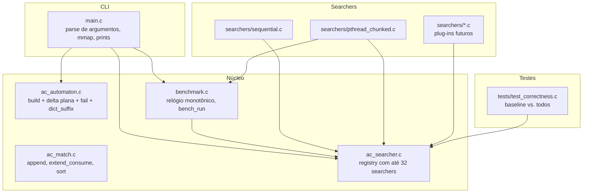
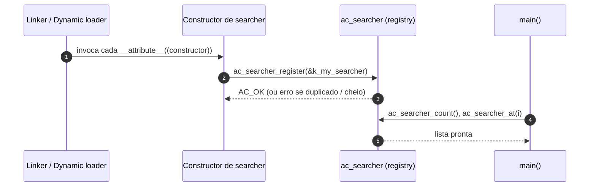

# Visão geral do sistema

O laboratório é organizado em torno de **três contratos** estáveis,
três fases bem definidas no tempo de vida de uma execução, e um
**registry de plug-ins** que permite trocar a implementação da fase
paralela sem mexer no resto.

## Contratos estáveis

| Contrato            | Header                  | O que define                                                                   |
|---------------------|-------------------------|---------------------------------------------------------------------------------|
| Autômato            | `include/ac_automaton.h`| Estruturas read-only (`goto_tbl`, `own_out_head`, `dict_suffix`, `outputs`)   |
| Lista de matches    | `include/ac_match.h`    | Container append-only, sem estado compartilhado                                 |
| Searcher (plug-in)  | `include/ac_searcher.h` | Função `search(...)` + registro via `__attribute__((constructor))`             |

Cada searcher só fala com o autômato (leitura) e com sua lista de
matches (escrita). Nada mais. Essa frugalidade é o que mantém a
ausência de locks viável.

## Fases no tempo

```mermaid
flowchart LR
    A[1. Carregar padrões<br/>ac_patterns_load_file] --> B[2. Construir autômato<br/>ac_automaton_build<br/>SEQUENCIAL]
    B --> C[3. Abrir input<br/>mmap se ≥ 64 MiB,<br/>read() caso contrário]
    C --> D[4. Para cada searcher:<br/>bench_run com warmup+iters]
    D --> E[5. (opcional) print de<br/>matches e métricas]
    E --> F[6. Liberar recursos]
```

A fronteira crítica é **entre 2 e 4**: a partir do retorno de
`ac_automaton_build()`, o autômato é tratado como imutável até o final
do processo. É essa imutabilidade que permite que `pthread_chunked`
(e qualquer searcher futuro) leia-o concorrentemente sem
sincronização.

## Módulos e responsabilidades



## Quem cria, quem lê, quem escreve

| Recurso               | Cria          | Lê                              | Escreve                |
|-----------------------|---------------|---------------------------------|------------------------|
| `ac_automaton_t`      | master        | todos os searchers (concorrente)| **somente o master**   |
| Buffer de texto       | master (mmap) | todos os searchers (concorrente)| ninguém na fase paralela |
| `out_matches` (final) | master        | master (impressão / merge)      | **somente o master**   |
| `worker_t::local`     | master        | worker dono                     | worker dono            |

Ou seja: tudo que é tocado em paralelo é estritamente read-only.
Tudo que é escrito é local a uma única thread.

## Como o CLI conecta tudo

`src/main.c` é só um *driver*. O fluxo, em pseudocódigo:

```text
main:
    pats, lens, n = ac_patterns_load_file(--patterns)
    (opcional) lowercase pats em --nocase
    file_buf = open_input(--input)        // mmap >= 64 MiB
    (opcional) lowercase file_buf em --nocase
    bench_marker(build) { ac_automaton_build(aut, pats, lens, n) }
    para cada searcher s in registry filtrado por --searcher:
        bench_run(s, aut, file_buf, cfg, warmup, iters, &result, &last_matches)
        bench_result_print(result)
        se --per-thread: chama s->search uma vez com out_metrics != NULL
        se --print-matches: ac_match_list_sort(&last_matches) + print
    libera tudo
```

`bench_run` (em `benchmark.c`) descarta as iterações de warmup,
mede `iters` execuções com `CLOCK_MONOTONIC`, e produz min/mean/max
em segundos + throughput em MiB/s.

## Discoverability de searchers



Como cada `src/searchers/*.c` é compilado e linkado automaticamente
pelo `Makefile` (`wildcard src/searchers/*.c`), basta colocar o
arquivo no lugar certo — o resto acontece em tempo de carga do
processo.

## Onde cada coisa vive

```
include/                        # contratos
  ac_common.h                   # tipos, macros, códigos de erro
  ac_automaton.h                # automato + loader de padrões
  ac_match.h                    # lista de matches
  ac_searcher.h                 # interface de plug-in
  benchmark.h                   # harness

src/
  ac_automaton.c                # build + dict_suffix + memória
  ac_match.c                    # lista append-only
  ac_searcher.c                 # registry estático (<= 32)
  benchmark.c                   # CLOCK_MONOTONIC + bench_run
  main.c                        # CLI (mmap, lowercase, prints)
  searchers/
    sequential.c                # baseline
    pthread_chunked.c           # primeiro paralelo

tests/
  test_correctness.c            # baseline vs. todos
  data/patterns_small.txt       # padrões compactos para testes

scripts/
  acquire_corpus.sh             # baixa Simple Wikipedia
  prepare_datasets.sh           # baixa Snort + Enron
  extract_snort_patterns.py     # extrai content: de regras Snort/Suricata
  extract_yara_patterns.py      # extrai padrões hex de regras YARA
  run_benchmarks.sh             # sweep sintético
  run_snort_enron_benchmarks.sh # sweep com Snort + Enron

docs/                           # este material
data/                           # corpora gerados (gitignored)
```

## Leituras seguintes

- [`automaton.md`](automaton.md) — como o `ac_automaton_t` é construído
  e por que o layout escolhido é amigável para `pthread_chunked`.
- [`parallelism.md`](parallelism.md) — invariantes que qualquer
  searcher novo precisa respeitar.
- [`benchmark-harness.md`](benchmark-harness.md) — como o harness mede
  e como interpretar a saída.
- [`datasets.md`](datasets.md) — onde os dados vêm, como reproduzir.
