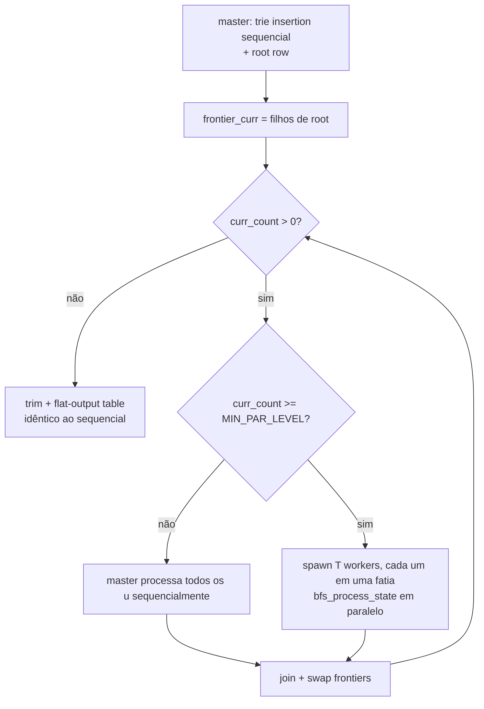

# Construção paralela do autômato (idea 4)

Página de arquitetura dedicada à **BFS paralela nível-síncrona** da
construção (`ac_automaton_build_par`), introduzida pela idea 4 do
laboratório. 
É a primeira (e única, por enquanto) variação que ataca a fase de
**construção** do autômato — todas as variações anteriores
paralelizam apenas a fase de busca.

## Motivação em uma frase

A BFS sequencial que materializa `fail`, `goto_tbl` e `dict_suffix`
domina o tempo de construção em dicionários grandes (~10⁵-10⁶
estados); como `depth(fail[u]) < depth(u)` é invariante textual de
Aho–Corasick, cada nível de BFS depende apenas de níveis anteriores
e pode ser processado por T workers em paralelo com uma barreira
entre níveis.

## API e seleção

```c
int ac_automaton_build_par(ac_automaton_t *aut,
                           const char *const *patterns,
                           const size_t *lengths,
                           size_t num_patterns,
                           int num_threads);
```

- **Coexiste com `ac_automaton_build`**: o build sequencial continua
  acessível e inalterado (a dissertação precisa medir build-time
  antes/depois sem trocar branch).
- **Degenerada para T ≤ 1**: `ac_automaton_build_par(..., 1)`
  delega *verbatim* para `ac_automaton_build`. Sem ramificação no
  caminho quente para T=1.
- **CLI**: o `aclab` escolhe via variáveis de ambiente —
  `AC_BUILD_PARALLEL=1` ativa o build paralelo; `AC_BUILD_THREADS`
  (opcional) sobrescreve o número de threads (default: `nproc`).

```bash
# Build sequencial (default)
./build/aclab --patterns data/patterns_et.txt --input ... --searcher pthread_chunked_flat

# Build paralelo, todas as cores
AC_BUILD_PARALLEL=1 ./build/aclab --patterns ... --input ... --searcher ...

# Build paralelo, 4 cores
AC_BUILD_PARALLEL=1 AC_BUILD_THREADS=4 ./build/aclab --patterns ... --input ... --searcher ...
```

A flag de busca (`--threads`) continua mandando apenas na fase de
busca; build e busca são parametrizados independentemente.

## Algoritmo, em uma frase

Nível-síncrona: a cada profundidade `d`, particiona o frontier
(`curr_count` estados) em fatias contíguas; cada worker chama
`bfs_process_state(u)` para os seus `u`s e empilha filhos reais em
`frontier_next` via `atomic_fetch_add` para reservar slots; após
`pthread_join`, troca `frontier_curr ⇄ frontier_next`, lê
`next_count`, repete até `curr_count == 0`.



Cada `bfs_process_state(u)`:

1. Lê `f = fail[u]`.
2. `dict_suffix[u]` = se `own_out_head[f] != NIL` então `f`, senão
   `dict_suffix[f]`. Ambos `f` e `dict_suffix[f]` foram finalizados
   no nível anterior.
3. Para cada byte `c ∈ [0, 256)`:
   - Se `raw_child[u, c] == NIL`: herda `goto_tbl[f, c]`.
   - Senão (`v = raw_child[u, c]`): escreve `goto_tbl[u, c] = v`,
     `fail[v] = goto_tbl[f, c]`, e empilha `v` em `frontier_next`
     via `atomic_fetch_add(next_count)` (slot reservado).

## Invariantes em que o algoritmo se apoia

1. **`depth(fail[u]) < depth(u)`** — invariante textual de AC; é o que
   permite que o nível `d` leia apenas dados do nível `< d`.
2. **Cada `u` no frontier tem rota goto única para suas raw_children**.
   Diferentes `u`s no mesmo nível têm `raw_child[u, c]` disjuntos
   (raw_child vem da trie, que é uma árvore: cada `v` tem **um** pai
   `u`). Logo:
   - Escritas em `goto_tbl[u, *]` não colidem entre workers.
   - Escritas em `dict_suffix[u]` não colidem.
   - Escritas em `fail[v]` (onde `v = raw_child[u, c]`) não colidem,
     porque cada `v` tem um único `u`.
3. **`frontier_next[slot] = v` é sempre em slot reservado** via
   `atomic_fetch_add`. Diferentes workers reservam slots disjuntos.
   Sem race de escrita no array.
4. **`pthread_join` é a barreira entre níveis**. Estabelece
   happens-before: todas as escritas do nível `d` são visíveis ao
   nível `d+1`.
5. **Trie insertion permanece sequencial**. Custo `O(total_pattern_length)`,
   tipicamente < 5 % do build total; paralelizar exigiria atomics em
   `raw_child` e em `aut->num_states`, com complexidade desproporcional
  ao ganho. Mantido deliberadamente fora de escopo nesta iteração.
6. **Build atomics são toleráveis**; **search atomics são proibidos**.
   O único atomic introduzido (`next_count`) fica restrito à fase
   de build e é tocado uma vez por descoberta de filho real — muito
   menos do que por byte de texto.

## Per-level guard

`MIN_PAR_LEVEL = 64`. Níveis com menos que isso são processados pelo
master (sequencial) — o overhead de `pthread_create` (~20-50 µs por
thread × T threads) supera o trabalho útil para frontiers minúsculos.
A profundidade da trie em IDS reais (Snort, ET) é alta (centenas a
milhares), mas os primeiros e últimos níveis são esparsos. O guard
deixa o paralelismo entrar exatamente onde paga.

```c
enum { MIN_PAR_LEVEL = 64 };
```

## Equivalência byte-a-byte com o build sequencial

O `ac_automaton_t` produzido por `ac_automaton_build_par(..., T)`
para qualquer `T ≥ 1` é **estritamente igual** byte a byte ao
produzido por `ac_automaton_build(...)`:

- `goto_tbl`, `dict_suffix`, `fail`-derivado, `own_out_head`,
  `outputs`, e as arenas da idea 5 (`flat_offset`, `flat_count`,
  `flat_pids`).

A ordem de inserção em `frontier_next` é não-determinística (workers
competem em `atomic_fetch_add`), mas isso só afeta a **ordem de visita
no próximo nível** — os **valores** escritos em `goto_tbl[u, c]`,
`fail[v]`, etc. dependem apenas do par `(u, c)` e da finalização do
nível anterior, ambos determinísticos.

`tests/test_correctness.c::automata_byte_equal` verifica isso em todos
os 6 casos do test suite × `T ∈ {2, 3, 4, 7, 8}` a cada `make test`.
Qualquer divergência é bug de idea 4.

## ThreadSanitizer

`make tsan` cobre tanto a fase de busca quanto a fase de build (o
test harness chama `ac_automaton_build_par` para cada caso de teste).
**Zero warnings esperados** — o autômato é estritamente read-only após
o build, e dentro do build:

- Escritas em `goto_tbl[u, *]`, `dict_suffix[u]`, `fail[v]` são
  thread-disjoint por construção (ver invariante 2).
- Escritas em `frontier_next[slot]` são thread-disjoint por construção
  (ver invariante 3).
- Leituras em `goto_tbl[f, c]` e `dict_suffix[f]` (com `f = fail[u]`)
  são reads de dados finalizados no nível anterior — happens-before
  via `pthread_join` (invariante 4).

`memory_order_relaxed` no `atomic_fetch_add` é suficiente: a barreira
de sincronização vem do join, não da operação atômica em si.

## Headline benchmark

Ambiente: 12-core x86_64, kernel 6.17, `-O3 -march=native`.

**Snort full** (`data/patterns_snort.txt`, 4188 padrões, 55479 estados):

| Estratégia                       | Build (ms) | Speedup |
|----------------------------------|------------|---------|
| `ac_automaton_build` (sequential)| ~50        | 1.00×   |
| `ac_automaton_build_par(T=12)`   | ~54        | 0.93×   |

Snort full é **pequeno demais** para amortizar overhead de paralelismo:
o BFS tem ~55k estados × 256 = ~14 M operações, executando em ~50 ms
sequencial. O ganho de paralelizar é menor que o custo de spawn × T
threads × levels. Documentado honestamente como uma faixa onde a idea
**empata**, não regride.

**ET full** (`data/patterns_et.txt`, 45290 padrões, 600830 estados):

| Estratégia                       | Build (mean ms, 3 runs) | Speedup |
|----------------------------------|--------------------------|---------|
| `ac_automaton_build` (sequential)| 787                      | 1.00×   |
| `ac_automaton_build_par(T=4)`    | 649                      | 1.21×   |
| `ac_automaton_build_par(T=12)`   | 603                      | **1.31×**|

ET é onde a idea ganha: 11× mais estados, BFS interna ~150 M
operações, distribuição de níveis com frontiers grandes em
profundidades intermediárias.

A escala de speedup é limitada por **largura de banda de memória** —
o BFS escreve `num_states × 256 × 4 ≈ 600 MiB` de `goto_tbl` em uma
única passada, mais reads dispersos em `goto_tbl[fail[u], c]` que
quase sempre falham L3. A 30 GB/s de banda DRAM (típico de uma CPU
desktop), 600 MiB são ~20 ms — limite teórico de speedup ~36×, mas
as leituras dispersas e o trabalho serializado (trie insertion, root
row, níveis sob `MIN_PAR_LEVEL`) reduzem o ganho efetivo.

## Cenários onde a idea perde

- **Dicionários muito pequenos** (< ~10 k estados): build total é
  sub-50ms; spawn overhead supera o ganho. Resultado: empate ou
  pequena regressão (~5%). Solução prática: não setar
  `AC_BUILD_PARALLEL` para essas cargas.
- **Tries muito rasas** (poucos padrões, longos): a maioria dos
  níveis cai sob `MIN_PAR_LEVEL` e roda sequencial.
- **Memória sob pressão** (alocação de `frontier_curr`,
  `frontier_next` proporcional a `num_states`): 600k estados × 8
  bytes = ~5 MiB de scratch extra durante o build. Negligível.

## Detalhes de implementação que importam

- **Escritas em `frontier_next` usam slots reservados**: cada worker
  faz `int32_t slot = atomic_fetch_add_explicit(&next_count, 1,
  memory_order_relaxed)` e escreve `frontier_next[slot] = v`.
  Diferentes workers reservam slots diferentes, então as escritas
  são thread-disjoint. `memory_order_relaxed` é seguro porque o
  master só lê `next_count` após `pthread_join`, que estabelece
  happens-before.
- **Particionamento estático** de `frontier_curr`:
  `start = (tid * curr_count) / T`,
  `end   = ((tid + 1) * curr_count) / T`.
  Cobre exatamente o frontier sem overlap; balanceamento é "good
  enough" para níveis grandes. Workers terminam praticamente no
  mesmo instante porque cada `u` custa um loop de 256 iterações
  com trabalho similar.
- **Tear-down em falha de spawn**: se `pthread_create` falhar a
  meio de um nível, join nos workers já spawned e retorna
  `AC_E_THREAD`. Não há fallback sequencial para o trecho restante
  — um sistema que falha em criar threads não merece confiar em
  finalizar o build.
- **Epílogo idêntico**: após a BFS paralela, o código que faz trim
  de arrays e o pass extra da idea 5 (flat output table) é
  literalmente o mesmo do build sequencial. Foi duplicado em
  `ac_automaton_build_par` para que o diff em `ac_automaton_build`
  permaneça zero (per loop instructions).

## Trabalho futuro

- **Pool persistente de workers + `pthread_barrier_t`** em vez de
  spawn/join por nível. Menor overhead em níveis profundos e
  estreitos. Mantido como otimização possível para a próxima iteração.
- **Per-level histogram** (logar `(level, frontier_size, level_ms)`
  via flag CLI opcional). Ajuda a discussão na dissertação sobre
  *quais* níveis ganham com paralelismo.
- **Build em NUMA-aware allocator** para máquinas com >1 socket
  (não relevante na máquina-alvo do TCC, mas documentado por
  completude). Fora de escopo nesta iteração.

## Searchers consumidores

Todos os searchers registrados consomem o mesmo `ac_automaton_t`,
independente de quem o construiu. O número de matches é determinístico
e idêntico ao build sequencial — comprovado por `make test` rodando
todos os searchers contra autômatos byte-equivalentes em
`{2,3,4,7,8}` threads de build.

## Leitura relacionada

- [`automaton.md`](automaton.md) — visão geral do autômato e da BFS
  sequencial (a quem este pass paraleliza).
- [`parallelism.md`](parallelism.md) — invariantes de paralelismo
  (busca); a idea 4 acrescenta a invariante 6 (build atomics toleráveis,
  search atomics proibidos).
- [`flat-outputs.md`](flat-outputs.md) — o pass adicional da idea 5
  permanece sequencial no epílogo, executado igual nos dois
  caminhos de build.
- [`../../../tcc_notes/sections/notes/methodology.md`](../../../tcc_notes/sections/notes/methodology.md) — motivação experimental e protocolo.
- [`../../../tcc_notes/sections/notes/results.md`](../../../tcc_notes/sections/notes/results.md) — números consolidados da idea 4.
