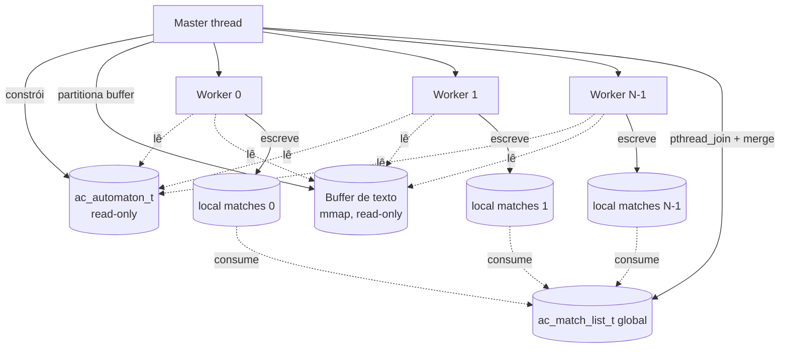

# Modelo de paralelismo

O laboratório usa **paralelismo de dados em memória compartilhada**
(intra-file parallelism), focado na **fase de busca**. A fase de
construção é estritamente sequencial. Esta página formaliza o modelo,
os invariantes e os argumentos de correção.

## Modelo conceitual



Em palavras:

- **Master**: constrói e particiona; depois aguarda.
- **Workers**: leem o autômato e o texto; escrevem **apenas** em sua
  lista privada.
- Sem locks, sem atomics, sem trocas de mensagens entre workers.

## Invariantes obrigatórios

Qualquer searcher novo precisa respeitar **todos**:

1. **Autômato imutável**: o ponteiro `aut` é tratado como
   `const ac_automaton_t *` em todo lugar; nenhuma escrita acontece
   após `ac_automaton_build()`.
2. **Sem locks no caminho quente**: `pthread_mutex_*`, `pthread_rwlock_*`,
   atomics ou variáveis compartilhadas mutáveis dentro do loop de
   varredura são **proibidos**.
3. **Matches são thread-local até `pthread_join`**: cada worker possui
   uma `ac_match_list_t` que apenas ele escreve e apenas o master lê
   após o join.
4. **Toda a comunicação acontece em `pthread_create` e `pthread_join`**:
   é a única barreira de memória necessária.
5. **Particionamento com overlap mínimo `max_pattern_len - 1`**:
   qualquer chunking que reporte matches para `[a, b)` precisa varrer
   `[max(0, a - overlap), b)` para garantir correção em fronteiras.

Violação de qualquer invariante quebra ou correção ou (muito mais
provável) consistência de medidas. `make tsan` é a primeira linha
de defesa contra a violação acidental do (1) ou (2).

## Particionamento e overlap

Considere `N` workers e um texto de tamanho `T`. Seja
`overlap = L - 1` onde `L = max_pattern_len`.

- Cada worker `i` é dono de `[core_start[i], core_end[i])`, com
  `core_start[0] = 0`, `core_end[N-1] = T`, e regiões disjuntas que
  cobrem o texto inteiro.
- O worker `i > 0` faz scan a partir de `core_start[i] - overlap`
  (o warm-up).
- Matches reportados são apenas aqueles com
  `end_pos >= core_start[i]` (regra de **ownership**).

```mermaid
flowchart LR
    A[Bytes do texto] --> B[Worker i-1: owns &#91;cs_{i-1}, ce_{i-1}&#41;]
    A --> C[Worker i: owns &#91;cs_i, ce_i&#41;<br/>scan a partir de cs_i - overlap]
    A --> D[Worker i+1: owns &#91;cs_{i+1}, ce_{i+1}&#41;<br/>scan a partir de cs_{i+1} - overlap]

    C -. matches em &#91;cs_i-overlap, cs_i&#41;<br/>são descartados .-> X[(ownership do anterior)]
```

### Argumento de correção (informal)

Seja `state_global(p)` o estado do DFA que uma varredura sequencial
começando em `0` teria após consumir `text[0..p)`. Para qualquer
`p` com `p >= L - 1`, esse estado depende apenas do sufixo
`text[p - L + 1 .. p)` (porque é o maior sufixo que pode ser prefixo
de algum padrão).

O worker `i` (com `i > 0`) começa em `state = 0` e consome
`text[scan_start[i]..p)`. Se `scan_start[i] = core_start[i] - (L-1)`,
então quando `p >= core_start[i]` a janela `text[p-(L-1)..p)` já está
contida no scan do worker, logo o estado interno coincide com
`state_global(p)`. A partir daí, a função de transição determinística
garante que a evolução dos estados é idêntica à versão global.

Conclusão: qualquer padrão que termina em posição `p ∈ [core_start[i],
core_end[i])` é detectado pelo worker `i`. E **apenas** por ele, porque
o worker `i+1` (cujo warm-up alcança `core_start[i+1]`) **descarta**
matches em sua região de warm-up (que é `[core_start[i+1] - (L-1),
core_start[i+1])`, totalmente dentro da região owned do worker `i`).

### Por que `L - 2` ou menor não funciona

Imagine um padrão de comprimento exato `L`. Se um worker pula direto
para `core_start[i]` (zero warm-up), e o padrão começa em
`core_start[i] - (L-1)` e termina em `core_start[i]`, o estado em
`core_start[i]` não terá rastreado os primeiros bytes do padrão e o
match será perdido. Com warm-up `L - 1`, o worker reentra no DFA em
um estado que sabe que viu esses prefixos, e o match termina sendo
emitido. Reduzir o warm-up arrisca padrões longos exatamente em
fronteiras.

## Política de ownership de matches

| Posição de `end_pos`                  | Quem reporta             |
|---------------------------------------|---------------------------|
| `[0, core_end[0])`                    | Worker 0                  |
| `[core_start[i], core_end[i])`        | Worker `i` (`i > 0`)      |
| `[scan_start[i], core_start[i])`      | **Ninguém** — é a região de warm-up; o worker `i-1` reporta. |

A regra é codada literalmente em `pthread_chunked.c`:

```c
if (AC_UNLIKELY(i < core_start)) continue;
```

## Sobre o merge

Após `pthread_join`, o master concatena as listas locais via
`ac_match_list_extend_consume`, em ordem crescente de `thread_id`.
Como cada worker é dono de uma faixa **contígua** e **disjunta** de
`end_pos`, e os matches em uma faixa já saem em ordem de `end_pos`,
a concatenação resulta em uma lista globalmente ordenada por
`end_pos` (e por `pattern_id` dentro do mesmo `end_pos`,
respeitando a ordem com que `outputs[]` é varrido).

Quando duas implementações precisam ser comparadas (ex.: em
`make test`), ambas as listas passam por `ac_match_list_sort` antes
da comparação, então a ordem do merge não importa para correção —
mas mantê-la canônica facilita debugar diffs no terminal.

## ThreadSanitizer

`make tsan` compila tudo com `-fsanitize=thread`. Como o autômato é
puramente read-only após a construção e cada lista de matches é
escrita por uma única thread, **não deve haver nenhum aviso**. Se
houver, é praticamente certo que um dos invariantes foi violado.

Padrões comuns de bug que o TSan pega:

- Tentativa de inicializar campos do `worker_t` **depois** de
  `pthread_create`.
- Uso indevido de um buffer global mutável.
- Caching de algum ponteiro do autômato dentro de uma estrutura
  thread-local e depois escrita acidental nele.

## Por que não OpenMP / TBB / atomics?

A escolha por **Pthreads** é alinhada com o requisito do TCC: ser
explícito sobre criação, particionamento e join, e poder argumentar
sobre o que acontece em cada microssegundo.

Searchers futuros podem perfeitamente usar:

- **SIMD** (AVX2/AVX-512) dentro do hot loop de cada worker, mantendo
  o mesmo modelo de chunks.
- **NUMA-awareness** (pinning de threads + alocação por nó).
- **Work-stealing** com chunks menores e fila de balanceamento.
- **GPU offload** com particionamento equivalente.

Em todos os casos, **os 5 invariantes acima continuam valendo** — só
mudam as primitivas usadas para implementá-los.

## Como medir o paralelismo

Pontos de medição relevantes:

- `bench_run` → mede a fase de busca completa, do `pthread_create` ao
  fim do merge.
- `worker_t::seconds` (exposto via `--per-thread`) → mede apenas o
  trecho `worker_main`, sem o overhead de criação e merge.
- `bench_marker(build)` → mede a fase sequencial de construção.

Em corpus realistas (≥ 100 MiB), o tempo de busca paralelo deve
dominar; o tempo de construção e o merge precisam ficar abaixo de
1-5% do total para que o gráfico de speedup faça sentido.

## Leitura relacionada

- [`automaton.md`](automaton.md) — por que o autômato é seguro de
  compartilhar (estritamente read-only).
- [`../searchers/pthread_chunked.md`](../searchers/pthread_chunked.md)
  — implementação concreta deste modelo.
- [`benchmark-harness.md`](benchmark-harness.md) — como o harness
  isola a fase paralela das outras fases.
