# Searcher `pattern_sharded_prefix`

Implementação da **idea 1** do roadmap (paralelismo a nível de
dicionário): em vez de particionar o texto, particionamos o
**dicionário**. Para `K` shards disjuntos de padrões, construímos `K`
sub-autômatos independentes; cada um é escaneado integralmente sobre
o texto por um worker dedicado, que emite apenas os matches dos
padrões pertencentes ao seu shard. Após `pthread_join`, o master
concatena as listas — sem overlap entre regiões do texto, sem dedup
de matches (shards têm pids globais disjuntos por construção).

- Fonte: [`src/searchers/pattern_sharded.c`](../../src/searchers/pattern_sharded.c)
- Registro: `__attribute__((constructor)) shard_register()`
- Notas do TCC: [`../../../tcc_notes/sections/notes/methodology.md`](../../../tcc_notes/sections/notes/methodology.md) e [`../../../tcc_notes/sections/notes/results.md`](../../../tcc_notes/sections/notes/results.md)

## Política de sharding

| Nome                      | Política de sharding                                                                          |
|---------------------------|-----------------------------------------------------------------------------------------------|
| `pattern_sharded_prefix`  | Bucket pelo primeiro byte (`shard = text[0] % K`). Estados se ramificam fortemente perto da raiz; dá sub-autômatos com hot path mais coerente em cache para textos de língua natural. Única política que entrega speedup real no regime alvo. |

O cache é fingerprintado por `(aut->goto_tbl, num_states, num_outputs, num_patterns, K)`
— `aut` por si só não basta quando a stack address é reusada entre
casos do `tests/test_correctness.c`.

## Modelo de execução

```mermaid
flowchart TD
    Master[Master thread] -->|"build sequencial K vezes"| S0[(sub_aut[0])]
    Master --> S1[(sub_aut[1])]
    Master --> SK[(sub_aut[K-1])]
    S0 --> R0[remap[0]: local pid -> global pid]
    S1 --> R1[remap[1]: local pid -> global pid]
    SK --> RK[remap[K-1]: local pid -> global pid]

    Master --> W0[Worker 0: scaneia TODO o texto via sub_aut[0]]
    Master --> W1[Worker 1: scaneia TODO o texto via sub_aut[1]]
    Master --> WK[Worker K-1: scaneia TODO o texto via sub_aut[K-1]]

    W0 -->|emite matches com global pid| L0[(local matches 0)]
    W1 -->|emite matches com global pid| L1[(local matches 1)]
    WK -->|emite matches com global pid| LK[(local matches K-1)]

    Master -->|"pthread_join + concat"| Out[(ac_match_list_t global)]
```

Características importantes:

- **Sem overlap entre regiões.** Todo worker vê todo byte; a regra
  `overlap = max_pattern_len - 1` que rege o chunking de texto não
  se aplica aqui.
- **Sem dedup no merge.** Os shards têm pids globais disjuntos, então
  nenhum (`end_pos`, `pattern_id`) pode ser emitido por mais de um
  worker. A concatenação é correta sem qualquer pós-processamento.
- **Sub-autômatos construídos antes do `pthread_create`.** A edge de
  happens-before fornecida pelo `pthread_create` torna as escritas do
  build visíveis aos workers; nenhuma sincronização adicional é
  necessária na fase de busca.
- **Emissão pela tabela achatada (idea 5).** Cada sub-autômato é
  construído via `ac_automaton_build` regular, que já popula
  `flat_offset/flat_count/flat_pids`. O hot loop do worker faz
  emissão flat (variante registrada de `pthread_chunked_flat`).

## Quando usar / quando NÃO usar

### Usar

- **Dicionários muito grandes que estouram L3** (regime IDS:
  Snort full, ET-Open). É o único searcher do laboratório que ataca
  diretamente o regime de cache blowout descrito nas notas consolidadas
  de [`methodology.md`](../../../tcc_notes/sections/notes/methodology.md)
  e [`results.md`](../../../tcc_notes/sections/notes/results.md).
- **Ortogonal ao chunking de texto.** Pode (em trabalho futuro) ser
  combinado com `pthread_chunked_v2`/`pthread_chunked_flat` para gerar
  uma curva 2-D de speedup `K × N` — nenhum dos searchers atuais
  expõe esse eixo.
- **Variante `pattern_sharded_prefix`** quando o texto é uma língua
  natural (ASCII com alta concentração em poucos bytes iniciais):
  empiricamente é a única política que **gera speedup real** no
  regime grande (ver tabela abaixo).

### NÃO usar

- **Dicionários pequenos que cabem em L2/L3** (Snort-100, ~12 MiB).
  Cada worker re-escaneia o texto inteiro; o segundo (e o oitavo)
  acesso é hit-de-cache barato, mas não é grátis, e o overhead de
  *K* leituras do texto satura a banda de memória bem antes da
  cache miss do autômato unificado. Esse é o modo de falha esperado
  da abordagem; a regressão é limpa e útil como cross-over experimental.
- **Quando memory-bandwidth é o gargalo dominante** e o autômato
  unificado já mora em L3 — o ganho do sub-autômato menor não
  compensa o aumento de tráfego de texto.
- **`K=1`** — nesse caso o searcher delega para `sequential_flat`,
  para não pagar overhead de `pthread_create+join` à toa.

## Estruturas consumidas

Da `ac_automaton_t` unificada (read-only, idêntica a todo searcher):

- `patterns[]` — usada **apenas no build** (para popular os
  sub-autômatos); os workers nunca a acessam.
- Demais campos (`goto_tbl`, `flat_*`, etc.) — usados para o
  fingerprint do cache, não no hot loop.

Estruturas próprias mantidas em cache estático (uma por política):

- `shards[K]` — cada `shard_t` contém um `ac_automaton_t` completo
  (com sua própria `goto_tbl`, `flat_*`, etc.) sobre o subconjunto
  de padrões do shard.
- `shards[k].pid_remap[]` — mapa local→global de tamanho
  `sub_aut.num_patterns`. Lido pelos workers ao emitir cada match.

O cache é construído **lazily** na primeira chamada para
`(aut, K, política)` e reaproveitado em iterações subsequentes
(warmup + iters do `bench_run` não paga rebuild).

## Fluxo do searcher

```mermaid
flowchart TD
    A[Início] --> B{aut->num_patterns == 0?}
    B -- sim --> Z[Retorna AC_OK&#40;0 matches&#41;]
    B -- não --> C[K = min&#40;cfg.num_threads, num_patterns&#41;]
    C --> D{K <= 1?}
    D -- sim --> S[delega -> sequential_flat]
    D -- não --> E{cache válido para &#40;aut, K, policy&#41;?}
    E -- não --> F[Atribui assignment&#91;i&#93; ∈ &#91;0, K&#41;<br/>conforme política]
    F --> G[Para cada k: build sub_aut&#91;k&#93;<br/>+ preenche pid_remap&#91;k&#93;]
    G --> H[Atualiza fingerprint do cache]
    H --> I
    E -- sim --> I[Aloca worker_t&#91;K&#93;, padded p/ cache line]
    I --> J[pthread_create&#40;K workers, scaneia todo o texto&#41;]
    J --> K[pthread_join todos]
    K --> L[Concat das listas locais em ordem thread_id asc.]
    L --> Z
```



## Invariantes em que o searcher se apoia

1. **Autômato unificado imutável após build.** Igual a todo o resto do
   laboratório. `pattern_sharded` lê dele *apenas no build dos
   sub-autômatos* (para extrair `patterns[i].text` e `length`); o
   hot loop dos workers ignora o autômato unificado por completo.
2. **Sub-autômatos imutáveis após o build dos shards.** Cada
   `sub_aut` herda os mesmos invariantes do `ac_automaton_t` regular;
   não é tocado depois do `shard_build`.
3. **`pid_remap[k]` é escrito antes do `pthread_create`.** Workers o
   lêem via `const int32_t *AC_RESTRICT remap`; a edge de
   happens-before do `pthread_create` garante visibilidade.
4. **Sem locks, mutexes, atomics no hot loop.** Match list por thread,
   merge sequencial no master após o join — mesma disciplina das
   outras pthread searchers.
5. **Cache invalidado por fingerprint multi-campo.** Qualquer mudança
   de `(goto_tbl pointer, num_states, num_outputs, num_patterns, K)`
   força rebuild. Resolve a reutilização de stack address em testes
   (mesmo bug identificado e corrigido na idea 3).
6. **Pids globais disjuntos entre shards** ⇒ merge é concat puro,
   sem dedup; o multiset de matches reportado por `pattern_sharded*`
   é idêntico ao de `sequential` após `ac_match_list_sort`.

## Garantias de correção

- **Determinístico**: igual ao `sequential` no multiset de matches.
  `make test` valida 9 casos × 3 políticas × 6 thread counts
  `{1, 2, 3, 4, 7, 8}`. Inclui os casos novos `mixed_lengths`,
  `prefix_bias_h` e `phonetic_16`, desenhados para estressar cada
  política de sharding.
- **TSan limpo**: `make tsan` (com `setarch -R` para contornar o
  glitch de mapping do TSan em alguns kernels) não reporta nenhum
  warning. O hot loop só lê `sub_aut[k].*` e `pid_remap[k][...]`,
  ambos read-only depois do build dos shards.
- **Empty shards** (quando `K > num_patterns` ou um bucket prefix
  resulta vazio): o worker atravessa o caminho `aut->num_states <= 1`
  e retorna imediatamente. Validado pelo caso `prefix_bias_h`
  (todos os padrões começam com `h`; com K=4 e prefix-policy, três
  shards ficam vazios).

## Custo do build dos sub-autômatos

Para cada `K`:

- **Tempo**: aproximadamente `K` × custo do build sequencial em uma
  fração `1/K` dos padrões. Como o build é `O(P + N · 256)` (P =
  trie size, N = num_states), o overhead total é da mesma ordem do
  `ac_automaton_build` original — typicamente ~10–20 % por shard
  para dicionários médios.
- **Memória**: pagamos o overhead de 256-byte transition row para
  cada estado em cada sub-autômato. A soma `Σ ac_automaton_memory_bytes(sub_aut[k])`
  é tipicamente 30–60 % maior que o `ac_automaton_memory_bytes(aut)`
  unificado (cada shard re-paga o overhead da raiz e dos prefixos
  comuns que originalmente compartilhavam estados na raiz).

O cache é construído uma única vez por `(aut, K, política)` e
re-usado em todas as `iters` do benchmark; o número headline é
**search-only**.

## Headline benchmark

Ambiente: 12-core x86_64, kernel 6.17, `-O3 -march=native`, GCC.
Corpus: `data/simplewiki.txt` (1.2 GiB de ASCII). Sequential é o
baseline single-thread (T=1). Throughput em **MB/s** (1 MB = 2²⁰ B).
Todos os números são `--warmup 1 --iters 3` (médias). Build usa
`AC_BUILD_PARALLEL=1` em todos os runs sharded.

### Dicionário pequeno: Snort-100 (1939 estados, ~2 MiB — cabe em L2)

| Searcher                     | K  | MB/s   | Speedup vs `sequential` |
|------------------------------|----|--------|-------------------------|
| `sequential`                 | —  | 184.80 | 1.00×                   |
| `pattern_sharded_prefix`     | 8  | 124.59 | 0.67×                   |

**Regressão esperada** pelo desenho original do experimento. O
autômato unificado já cabe em L2; sharding paga *K* re-leituras do
texto sem ganhar nada em cache de estados.

### Dicionário médio: Snort-1k (11 974 estados, ~12 MiB — em L3)

| Searcher                     | K  | MB/s   | Speedup vs `sequential` |
|------------------------------|----|--------|-------------------------|
| `sequential`                 | —  | 135.60 | 1.00×                   |
| `pattern_sharded_prefix`     | 4  | 135.62 | **1.00×** (empate)      |

A política `prefix` empata o sequencial pela primeira vez — sinal de
que a fronteira do cross-over começa a aparecer.

### Dicionário grande: Snort full (55 479 estados, ~56 MiB — estoura L3)

| Searcher                     | K  | MB/s   | Speedup vs `sequential` |
|------------------------------|----|--------|-------------------------|
| `sequential`                 | —  |  96.68 | 1.00×                   |
| `pattern_sharded_prefix`     | 8  | **115.50** | **1.19×**           |

**Cross-over confirmado** para `pattern_sharded_prefix`. O bucketing por
primeiro byte concentra prefixos similares em um mesmo shard,
produzindo sub-autômatos com hot path mais denso em cache para o
texto natural de língua inglesa (Wikipedia).

### Dicionário enorme: ET-32 (508 896 estados, ~507 MiB — >>L3)

| Searcher                     | K  | MB/s   | Speedup vs `sequential` |
|------------------------------|----|--------|-------------------------|
| `sequential`                 | —  |  41.19 | 1.00×                   |

Aqui a banda de memória do texto é o gargalo: cada thread escaneia
1.2 GiB e nenhuma combinação `(K, política)` consegue compensar.
Essa motivação levou à variante 2-D **`K × N`** posteriormente
implementada em [`pthread_2d_sharded_chunked.md`](pthread_2d_sharded_chunked.md),
que acabou perdendo para `pthread_chunked_flat` neste hardware.

## Modos de falha (honestos)

- **Banda de memória do texto** é o gargalo fundamental do baseline
  ingênuo (1 worker / 1 scan completo por shard). Para `K · text_len`
  acima de ~10 GiB de tráfego, RAM bandwidth domina e nenhum ganho
  de cache de estados compensa.
- **Distribuição patológica de prefixos**: se todos os padrões
  começam com o mesmo byte, `pattern_sharded_prefix` concentra
  todos em um único shard (testado em `prefix_bias_h`). Correção
  é trivial (LPT ou round-robin como fallback automático); mantido
  em aberto porque o caso real é raro.
- **Overhead de build** é `K`× o build sequencial. Para `K=12` no
  dicionário ET (~1.5 s sequencial), o build dos 12 sub-autômatos
  custa ~2-3 segundos. Amortizável em scans grandes, mas relevante
  para benchmarks curtos.

## Como o harness chama

```text
shard_search(aut, text, text_len, cfg /* num_threads = K */,
             out_matches,
             out_thread_metrics → tm[K], out_num_thread_metrics → K)
```

`tm[k].bytes_scanned = text_len` (cada worker escaneia o texto
inteiro), `tm[k].matches_found` é a contagem do shard `k`.

## Trabalho futuro

- **`K × N` 2-D**: combinar shard `K` com chunk `N` de texto, de modo
  que `K · N = #cores`. Esse experimento já foi fechado em
  [`pthread_2d_sharded_chunked.md`](pthread_2d_sharded_chunked.md) e,
  no i5-1235U, falsificou a hipótese de composição positiva.
- **Política adaptativa**: usar o histogram da árvore de prefixos
  para escolher entre LPT e prefix em tempo de build. Caro e
  provavelmente fora de escopo do TCC; cita como engenharia futura.
- **Cache em disco**: para dicionários grandes, persistir os
  sub-autômatos em arquivo (mmap-able) e dispensar o rebuild a
  cada execução.

## Leituras relacionadas

- Consolidação metodológica e números: [`../../../tcc_notes/sections/notes/methodology.md`](../../../tcc_notes/sections/notes/methodology.md) e [`../../../tcc_notes/sections/notes/results.md`](../../../tcc_notes/sections/notes/results.md).
- Composição 2-D já implementada: [`pthread_2d_sharded_chunked.md`](pthread_2d_sharded_chunked.md).
- Para o eixo ortogonal (chunking de texto):
  [`pthread_chunked_flat.md`](pthread_chunked_flat.md),
  [`pthread_chunked_v2.md`](pthread_chunked_v2.md).
- Sweep automatizado: `scripts/run_pattern_sharded_sweep.sh`.
