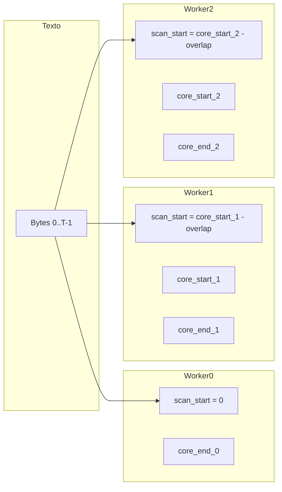
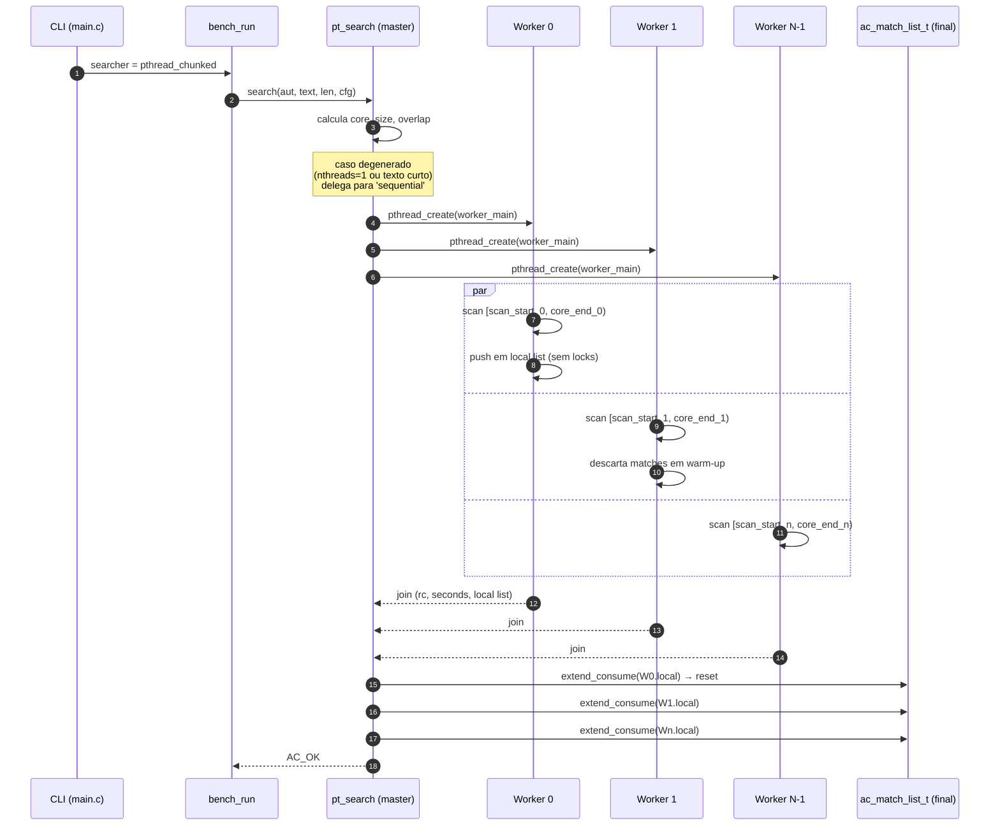

# Searcher `pthread_chunked`

Primeira variante paralela do laboratório. Aplica **paralelismo de
dados** sobre o mesmo automato Aho–Corasick: o texto é particionado em
faixas contíguas (chunks) e uma pool de threads POSIX as percorre
concorrentemente, cada thread lendo o automato compartilhado em modo
read-only e acumulando matches em uma lista privada.

- Fonte: [`src/searchers/pthread_chunked.c`](../../src/searchers/pthread_chunked.c)
- Registro: `__attribute__((constructor)) pt_register()`
- Descrição: *Pthreads, fixed-size chunks with overlap, thread-local lists*

## Princípios de projeto

1. **Zero locks no caminho quente**. Não há mutex/atomics durante a
   varredura. Toda sincronização aparece apenas em `pthread_create`
   e `pthread_join`.
2. **Automato compartilhado por ponteiro**. Imutável após
   `ac_automaton_build()`; cada thread lê os mesmos arrays sem
   coordenação.
3. **Listas thread-local**. Cada worker escreve em sua própria
   `ac_match_list_t`. O master concatena tudo após o join.
4. **Overlap mínimo entre chunks** = `max_pattern_len - 1`. Garante
   correção em fronteiras sem custo de comunicação inter-thread.
5. **Ownership de matches por posição**. Matches cujo `end_pos`
   pertence à região de warm-up são descartados pelo worker atual
   (o worker anterior os reportará).

## Particionamento dos chunks

Sejam `N` threads e `T = text_len`. O laboratório usa divisão por
**teto** para impedir que o último worker receba uma fatia maior:

```
core_size      = ceil(T / N)
core_start[i]  = i * core_size                  // inclusivo
core_end[i]    = min(core_start[i] + core_size, T)   // exclusivo
overlap        = max_pattern_len - 1
scan_start[i]  = (i == 0 || core_start[i] < overlap) ? 0
                                                     : core_start[i] - overlap
```

- `[core_start[i], core_end[i])` é a região **owned** do worker.
- `[scan_start[i], core_start[i])` é o **warm-up** (matches descartados).
- `[scan_start[i], core_end[i])` é o intervalo de bytes efetivamente
  varrido.



A região **`[scan_start, core_start)`** é varrida só para *aquecer* o
DFA: o estado a partir do qual a emissão pode acontecer já será o
mesmo que uma varredura global produziria.

## Por que `overlap = L - 1` basta

O estado do DFA de Aho–Corasick após consumir um prefixo `σ` é
totalmente determinado pelo **maior sufixo de `σ` que é prefixo de
algum padrão**. O comprimento desse sufixo é, por definição, no máximo
`L = max_pattern_len`.

Logo, se um worker começa do estado inicial e consome os `L - 1`
bytes imediatamente anteriores a `core_start`, então no momento em
que ele lê o byte em `core_start` o estado interno coincide com o
estado que uma varredura global teria nesse mesmo ponto. A partir
daí, a evolução é determinística e idêntica à da versão sequencial.

Bonus: como cada padrão tem no máximo `L - 1` caracteres "fora" da
região owned, qualquer padrão que cruzaria a fronteira `core_start[i]`
será detectado por **exatamente um** worker — o worker `i`, dentro
de sua região owned. Não há duplicação nem perda.

## Fluxo macro (master + workers)



A janela paralela é exatamente o intervalo `pthread_create..pthread_join`.
O *merge* das listas é sequencial e roda no master, mas é
essencialmente `memcpy` (ver `ac_match_list_extend_consume`).

## Loop interno do worker

```mermaid
flowchart TD
    A[Início worker:<br/>state=0, i=scan_start] --> B{i < core_end?}
    B -- não --> Z[Salva tempo, retorna]
    B -- sim --> C[c = text&#91;i&#93;]
    C --> D[state = goto_tbl&#91;state*256+c&#93;]
    D --> E{i < core_start?<br/>(warm-up)}
    E -- sim --> F[i++, NÃO emitir]
    E -- não --> G{own_out_head&#91;state&#93;!=NIL<br/>OU dict_suffix&#91;state&#93;!=NIL?}
    G -- não --> F
    G -- sim --> H[Emite todos os matches:<br/>own_out_head&#91;state&#93;<br/>→ sobe via dict_suffix]
    H --> I[push em w-&gt;local]
    I --> F
    F --> B
```

Note que a condição `i < core_start` é marcada com `AC_UNLIKELY`:
ela só é verdadeira nos primeiros `L - 1` bytes do worker. O hot
path do loop é virtualmente o mesmo do searcher `sequential`.

## Casos degenerados (fallback para `sequential`)

O searcher rotula para a implementação sequencial quando:

- `cfg->num_threads <= 1`, **ou**
- `text_len <= 2 * overlap`, **ou**
- `text_len < num_threads * 64` (chunk muito pequeno → criar threads
  fica mais caro que escanear direto).

Isso impede regressão de performance em textos curtos. A escolha não
afeta correção — `sequential` produz exatamente o mesmo conjunto de
matches.

## Tabela de variáveis-chave do worker

| Campo               | Tipo                | Significado                                                                 |
|---------------------|---------------------|-----------------------------------------------------------------------------|
| `thread_id`         | `int`               | índice 0..N-1, usado para ordem de merge                                   |
| `aut`               | `const ac_automaton_t *` | autômato compartilhado, read-only                                     |
| `text`              | `const char *`      | buffer global de entrada                                                   |
| `scan_start`        | `size_t`            | onde a varredura começa (inclui warm-up)                                   |
| `core_start`        | `size_t`            | primeira posição em que matches são reportados                             |
| `core_end`          | `size_t`            | fim exclusivo da região owned                                              |
| `local`             | `ac_match_list_t`   | lista thread-local de matches                                              |
| `seconds`           | `double`            | tempo do worker, medido com `bench_now_ns()`                               |
| `rc`                | `int`               | código de erro (`AC_OK` em caso normal)                                    |

## Métricas por thread (`--per-thread`)

`pt_search` opcionalmente preenche `out_thread_metrics`. Cada entrada
contém:

- `thread_id`
- `seconds`: tempo de varredura do worker, isolado.
- `bytes_scanned`: `core_end - scan_start` (inclui warm-up).
- `matches_found`: contagem da lista thread-local antes do merge.

Útil para diagnosticar **desbalanceamento** (ex.: um worker
gastando significativamente mais tempo) e para validar que o overlap
não está dominando o custo.

## Correção: como é validada

`make test` (binário em `tests/test_correctness.c`) compara o
`pthread_chunked` contra `sequential` para cada caso e cada uma das
contagens de threads `{1, 2, 3, 4, 7, 8}`. Os casos foram desenhados
para colocar matches **em** fronteiras de chunk e variar o tamanho
do alfabeto efetivo.

Para validar ausência de races, use `make tsan` — o ThreadSanitizer
acompanha todos os acessos ao automato (que devem ser apenas leituras)
e às listas locais (que não devem ser tocadas por outras threads).

## Diagnósticos comuns

| Sintoma                                             | Causa provável                                                  |
|-----------------------------------------------------|------------------------------------------------------------------|
| Throughput não escala além de 2-4 threads           | Limite de memory bandwidth — o DFA é grande e domina o tráfego  |
| Worker 0 consistentemente mais lento                | Sem warm-up: ele faz `iters` operações de page-in que os demais já receberam |
| Diferença de matches vs. `sequential`               | Overlap incorreto, ou ownership não sendo respeitada            |
| `make tsan` reporta race em `ac_automaton_t`        | Algum searcher está escrevendo no autômato — não pode           |

## Complexidade

- **Trabalho total**: `O(N · overlap + |texto|)` = `O(|texto|)` para
  `N · L` pequeno em relação a `|texto|`.
- **Tempo paralelo**: `O((|texto| + N · overlap) / N)` ≈ `O(|texto| / N)`
  para textos suficientemente longos.
- **Memória adicional**: `O(N + Σ matches por worker)`.

## Leitura relacionada

- [`../architecture/parallelism.md`](../architecture/parallelism.md) —
  invariantes de memória compartilhada e racional do overlap.
- [`../architecture/overview.md`](../architecture/overview.md) —
  diagrama do laboratório como um todo.
- [`sequential.md`](sequential.md) — baseline contra o qual se mede.
