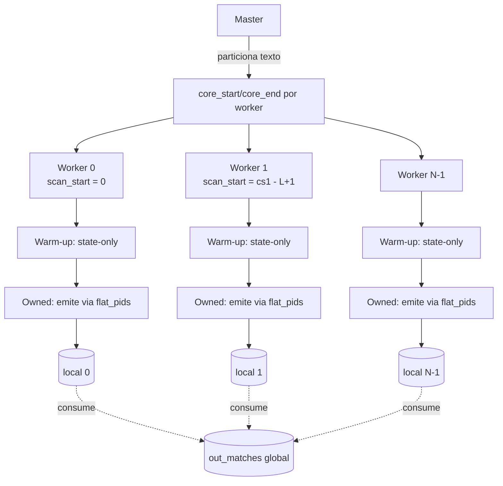
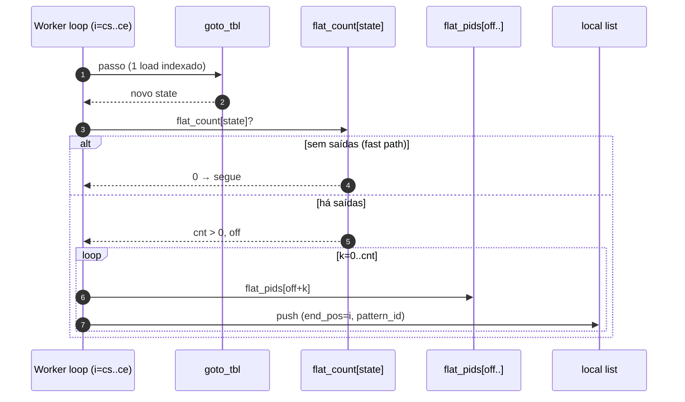

# Searcher `pthread_chunked_flat`

Combinação do **chunking com warm-up/owned dividido** do
[`pthread_chunked_v2`](pthread_chunked_v2.md) com a **tabela achatada
de pattern_ids** da idea 5 (mesma usada por
[`sequential_flat`](sequential_flat.md)). É a forma cumulativa do
ganho: paralelismo nos bytes do texto **e** layout linear na emissão
de matches por estado.

- Fonte: [`src/searchers/pthread_chunked_flat.c`](../../src/searchers/pthread_chunked_flat.c)
- Registro: `__attribute__((constructor)) flat_register()`
- Descrição: *Pthreads chunks (v2 layout) + flat output table (idea 5)*
- Notas do TCC: [`../../../tcc_notes/sections/notes/methodology.md`](../../../tcc_notes/sections/notes/methodology.md) e [`../../../tcc_notes/sections/notes/results.md`](../../../tcc_notes/sections/notes/results.md)
- Layout transformado: [`../architecture/flat-outputs.md`](../architecture/flat-outputs.md)

## Quando usar

- **Caso default** para benchmarks de paralelismo após idea 5: nada
  no chunking muda em relação ao `pthread_chunked_v2`, mas a emissão
  fica significativamente mais barata e o speedup pode subir uma
  fração inteira no mesmo número de threads.
- Em dicionários reais de IDS (Snort, ET), onde matches densos
  amortizam o custo de chain walk no v2 — aqui é onde o flat layout
  brilha mais.

## Quando NÃO usar

- Em corpus muito pequenos: o searcher faz fallback automático para
  `sequential_flat` (e, se não registrado, para o `sequential`
  baseline). A heurística é a mesma do v2:

  ```text
  nthreads == 1
  || text_len <= 2 * (max_pattern_len - 1)
  || text_len <  nthreads * 64
  ```

## Algoritmo, em uma frase

Idêntico ao [`pthread_chunked_v2`](pthread_chunked_v2.md) — overlap
`L-1`, split warm-up/owned, `worker_t` cache-padded — exceto que o
loop owned lê `(flat_offset[state], flat_count[state])` em vez de
caminhar `(own_out_head, dict_suffix, outputs)`.

## Estruturas consumidas

Da `ac_automaton_t` (read-only):

- `goto_tbl[state * 256 + byte]` — função de transição.
- `flat_offset[state]`, `flat_count[state]`, `flat_pids[]` — arenas
  da idea 5.
- `max_pattern_len` — para derivar `overlap = max_pattern_len - 1`.

Compartilhada entre todas as threads sem locks (todas leem; o
autômato é imutável após o build).

## Invariantes preservados

1. **Overlap = `max_pattern_len - 1`** entre chunks adjacentes
   (idêntico ao v2; ver
   [`../architecture/parallelism.md`](../architecture/parallelism.md)).
2. **Disjoint ownership** — matches com `end_pos ∈ [core_start[i],
   core_end[i])` pertencem ao worker `i` e apenas a ele. A região de
   warm-up (`[scan_start[i], core_start[i])`) é varrida sem emissão.
3. **Matches thread-local** — cada worker escreve apenas em sua
   `ac_match_list_t` (campo `local`). O master concatena via
   `ac_match_list_extend_consume` após `pthread_join`.
4. **Sem atomics/locks no hot loop** — toda a fase paralela só lê
   ponteiros const, escreve no `local` privado e produz `seconds`
   após a janela timed.
5. **Multiset preservado** — `flat_pids[s]` é construído na mesma
   ordem que o chain walk emitiria, então a lista após
   `ac_match_list_sort` é bit-equivalente ao `sequential`.

## Fluxo



## Caminho do hot loop (fase owned)



A diferença prática vs. `pthread_chunked_v2`:

- v2 paga, por match, uma cadeia de loads dependentes em
  `dict_suffix[l]` e em `outputs[o].next`. Os dois arrays escapam de
  L2 em dicionários grandes.
- flat substitui a cadeia por uma leitura linear de `flat_pids`,
  contígua na memória — o prefetcher de hardware cobre o acesso.

## Garantias

- **Determinístico após sort**: igual ao `sequential`. O test harness
  (`tests/test_correctness.c`) compara contra a baseline em
  `{1,2,3,4,7,8}` threads e em todos os 6 casos (incluindo o caso
  `dict_chain` introduzido junto da idea 5).
- **TSan-clean**: zero warnings sob `make tsan` — toda a leitura do
  autômato é read-only e cada worker escreve apenas em sua própria
  lista.

## Como o harness chama

```text
flat_search(aut, text, text_len, cfg,
            out_matches,
            out_thread_metrics → array de tamanho spawned (ou NULL),
            out_num_thread_metrics → spawned (ou 0))
```

Reporta `ac_thread_metric_t` por worker (mesmo formato que v2):
`thread_id`, `seconds`, `bytes_scanned = core_end - scan_start`,
`matches_found = local.count`.

## Headline benchmark

Ambiente: 12-core x86_64, kernel 6.17, `-O3 -march=native`,
`AC_BUILD_PARALLEL` ausente (build sequencial).

Corpus: `data/simplewiki.txt` (~1.2 GiB) com dicionário Snort
(`data/patterns_snort.txt`, 4188 padrões, 55479 estados).

| Searcher                | T  | Throughput (MB/s) | Mean (ms) | Speedup vs. `sequential` |
|-------------------------|----|-------------------|-----------|--------------------------|
| `sequential`            | 1  | 192.82            | 6308.8    | 1.00×                    |
| `sequential_flat`       | 1  | 244.16            | 4982.3    | 1.27×                    |
| `pthread_chunked_v2`    | 12 | 791.11            | 1537.6    | 4.10×                    |
| `pthread_chunked_flat`  | 12 | **1444.17**       | 842.3     | **7.49×**                |

Speedup do flat sobre o v2 em **multi-thread**: **1.83×**. O ganho do
layout é multiplicativo com o do chunking — exatamente o que a idea 5
prevê.

Build time: 50–60 ms (incluindo o pass extra da idea 5 sobre os
~55k estados). O pass adicional fica abaixo do ruído (<1 ms em
dicionários desta classe).

## Complexidade

- **Tempo da busca**: `O(|texto|/T + |saídas reportadas|/T)` no caso
  bem-balanceado.
- **Custo de coordenação**: `O(T)` para `pthread_create`/`join` +
  merge sequencial de listas thread-local (< 1% do total em corpus
  grandes).
- **Memória extra**: ~`64 * T` bytes para `worker_t` + capacidade
  reservada nas listas locais (4096 entradas iniciais por worker).

## Próximos passos / leituras relacionadas

- Para o irmão single-thread, [`sequential_flat.md`](sequential_flat.md).
- Para a variante chain-walk equivalente, [`pthread_chunked_v2.md`](pthread_chunked_v2.md).
- Para o modelo de chunking e correção em fronteira, [`../architecture/parallelism.md`](../architecture/parallelism.md).
- Para o layout do flat output table, [`../architecture/flat-outputs.md`](../architecture/flat-outputs.md).
- Veredito consolidado da idea 5: [`../../../tcc_notes/sections/notes/conclusion.md`](../../../tcc_notes/sections/notes/conclusion.md).
