# Searcher `pthread_chunked_v2`

Variante micro-otimizada do [`pthread_chunked`](pthread_chunked.md).
Mantém o mesmo modelo de paralelismo (chunks estáticos contíguos +
overlap `max_pattern_len - 1`) e troca apenas detalhes do laço interno
e do layout dos workers.

- Fonte: [`src/searchers/pthread_chunked_v2.c`](../../src/searchers/pthread_chunked_v2.c)
- Registro: `__attribute__((constructor)) v2_register()`
- Descrição: *Pthreads chunks; split warm-up/owned loops; cache-pad worker_t*

## O que muda em relação ao `pthread_chunked`

| Aspecto                       | `pthread_chunked` (v1)                                | `pthread_chunked_v2`                                              |
|-------------------------------|--------------------------------------------------------|--------------------------------------------------------------------|
| Loop de varredura             | Único laço sobre `[scan_start, core_end)` com `if (i < core_start) continue` | **Dois laços separados**: warm-up (só atualiza estado) + owned (emite matches) |
| Branch no hot path            | 1 branch por byte (warm-up) — preditivo, mas presente | Estruturalmente eliminado                                          |
| Layout do `worker_t`          | `calloc` simples; padding implícito                    | `posix_memalign(64)` + padding explícito → 1 cache line por worker |
| Reserva da lista local        | 1024 entradas (∼16 KiB)                                | 4096 entradas (∼64 KiB) — afasta os primeiros realloc da janela cronometrada |

Os três ajustes são ortogonais e independentemente reversíveis. Nenhum
deles altera a política de overlap, a regra de ownership ou a saída.

## Princípios preservados

1. **Zero locks no caminho quente**. Sem mutex/atomics.
2. **Autômato compartilhado e read-only**.
3. **Listas thread-local**. Merge sequencial após `pthread_join`.
4. **Overlap = `max_pattern_len - 1`**. Mesma garantia formal de
   correção do v1.
5. **Ownership por `end_pos`**. Matches na região de warm-up pertencem
   ao worker anterior — mas aqui não há sequer um *branch* dizendo
   isso: o warm-up simplesmente não tem código de emissão.

## Loop interno (v2)

```mermaid
flowchart TD
    A[Start worker:<br/>state=0] --> B{Fase 1<br/>i &lt; core_start?}
    B -- sim --> C[state = goto&#91;state*256+text&#91;i&#93;&#93;<br/>i++]
    C --> B
    B -- não --> D{Fase 2<br/>i &lt; core_end?}
    D -- não --> Z[Salva tempo, retorna]
    D -- sim --> E[state = goto&#91;state*256+text&#91;i&#93;&#93;]
    E --> F{own_head&#91;state&#93; ou<br/>dict_suffix&#91;state&#93;?}
    F -- não --> G[i++]
    F -- sim --> H[Emite todos os matches<br/>via own_head + dict_suffix]
    H --> G
    G --> D
```



Comparado ao diagrama do v1, a fase 1 perde o teste `own_head/dict_suffix`
e a fase 2 perde o teste `i < core_start`. O hot path do v1 já era
linear, mas as duas verificações eram pagas em cada byte.

## Alocação cache-line aware

```c
char _pad[64 - ((sizeof(int) * 2
              + sizeof(const ac_automaton_t *)
              + sizeof(const char *)
              + sizeof(size_t) * 3
              + sizeof(ac_match_list_t)
              + sizeof(double)) % 64)];
```

A intenção é defensiva: nenhum worker escreve em campos de seu vizinho,
mas variações de coerência (write-allocate em CPUs com prefetch de
linhas adjacentes) podem causar invalidações cruzadas durante o
benchmark se dois workers compartilharem uma linha. O custo é apenas o
arredondamento para 64 B por worker (≤ 64 B × `nthreads` = poucos KiB
para qualquer `nthreads` realista).

`posix_memalign(64)` garante que o **array** comece em uma fronteira
de cache-line; o padding interno garante que cada elemento ocupe um
múltiplo dela.

## Casos degenerados

Idênticos ao v1:

- `cfg->num_threads <= 1` → delega para `sequential`.
- `text_len <= 2 * overlap` → delega para `sequential`.
- `text_len < num_threads * 64` → delega para `sequential`.

Nada disso afeta correção — `sequential` é a referência.

## Resultados em `snort + enron_corpus.txt` (1,36 GiB)

Medições com `--warmup 1 --iters 5`, máquina i5-1235U (12 cores
lógicas, 10 físicos, 2P+8E). Coluna `min` é o menor dos 5 tempos
cronometrados; `mean` é a média; `MB/s` derivado de `mean`. Variância
inter-run é alta (~10%) — diferenças menores que 5% devem ser tratadas
como ruído.

| Searcher              | Threads | min (ms) | mean (ms) | MB/s (mean) |
|-----------------------|--------:|---------:|----------:|------------:|
| sequential            |   1     | 6.075    | 6.920     | 195,9       |
| pthread_chunked       |   1     | 7.265    | 7.381     | 183,6       |
| **pthread_chunked_v2**|   1     | 7.306    | 7.369     | 183,9       |
| pthread_chunked       |   2     | 4.573    | 4.701     | 288,3       |
| **pthread_chunked_v2**|   2     | 4.507    | 4.588     | 295,4       |
| pthread_chunked       |  12     | 1.841    | 1.914     | 708,2       |
| **pthread_chunked_v2**|  12     | 1.766    | 1.851     | 732,4       |

O ganho relativo do v2 sobre o v1 nesse cenário é da ordem de **+3% a
+4% no tempo médio** em 2 e 12 threads. No regime de 1 thread os dois
ficam praticamente empatados — esperado, porque a única diferença
visível seria o tamanho da reserva inicial.

## Quando o ganho deve aparecer

- Workloads onde o **número de matches é baixo** em relação ao texto
  varrido: o hot path domina e qualquer branch a menos por byte é
  perceptível.
- Configurações com **muitas threads** onde a região de warm-up cresce
  proporcionalmente ao número de workers (cada worker carrega `L-1`
  bytes de warm-up).
- CPUs com **prefetcher agressivo de linhas adjacentes** (Intel Sandy
  Bridge+, AMD Zen+), onde o padding evita invalidações cruzadas.

## Quando o ganho não aparece

- Texto extremamente denso em matches: a emissão domina e o ganho
  estrutural do hot path é diluído.
- Apenas 1 thread: warm-up = 0 bytes, padding sem efeito; cai para o
  comportamento do `sequential` via fallback.

## Correção

`make test` valida `pthread_chunked_v2` em todas as contagens
`{1, 2, 3, 4, 7, 8}` contra o baseline `sequential` em todos os casos
da suíte. Resultado da última execução: **All correctness tests
PASSED.**

## Leitura relacionada

- [`pthread_chunked.md`](pthread_chunked.md) — o v1, ponto de partida.
- [`../architecture/parallelism.md`](../architecture/parallelism.md) —
  invariantes que o v2 herda.
