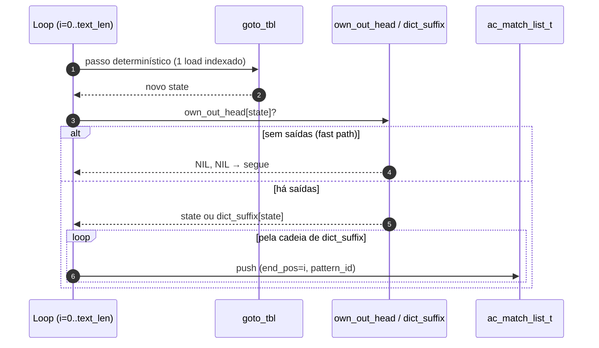

# Searcher `sequential`

Implementação de referência **single-thread** do Aho–Corasick. É o
baseline contra o qual toda variante paralela é validada em
correção e medida em throughput. Mantém-se deliberadamente curto e
direto: aqui, simplicidade é uma feature.

- Fonte: [`src/searchers/sequential.c`](../../src/searchers/sequential.c)
- Registro: `__attribute__((constructor)) seq_register()`
- Descrição: *Single-threaded baseline AC scan*

## Quando usar

- Como **ground-truth** em `make test`.
- Como **baseline** de throughput em `make bench`.
- Para textos muito pequenos (ver fallback no `pthread_chunked`),
  onde o custo de criar threads supera o ganho.

## Algoritmo, em uma frase

Percorre cada byte do texto, dá um passo na função de transição
determinística do DFA e, se o estado atual tem matches diretos ou
herdados por `dict_suffix`, emite todos eles.

## Estruturas consumidas

Da `ac_automaton_t` (read-only):

- `goto_tbl[state * 256 + byte]` — próxima transição.
- `own_out_head[state]` — cabeça da lista de patterns que **terminam**
  exatamente em `state`.
- `dict_suffix[state]` — ancestral mais próximo na cadeia de falha que
  tem `own_out_head != AC_NIL`.
- `outputs[]` — arena ligada com pares `(pattern_id, next)`.

O detalhamento de cada estrutura está em
[`../architecture/automaton.md`](../architecture/automaton.md).

## Fluxo do searcher

```mermaid
flowchart TD
    A[Início: state = 0, i = 0] --> B{i < text_len?}
    B -- não --> Z[Retorna AC_OK]
    B -- sim --> C[c = text&#91;i&#93;]
    C --> D[state = goto_tbl&#91;state*256 + c&#93;]
    D --> E{own_out_head&#91;state&#93; != NIL<br/>OU dict_suffix&#91;state&#93; != NIL?}
    E -- não --> F[i++]
    E -- sim --> G[l = own_out_head&#91;state&#93; != NIL<br/>? state : dict_suffix&#91;state&#93;]
    G --> H{l != NIL?}
    H -- não --> F
    H -- sim --> I[Para cada o em own_out_head&#91;l&#93;:<br/>emite match (end=i, pat=outputs&#91;o&#93;.pattern_id)]
    I --> J[l = dict_suffix&#91;l&#93;]
    J --> H
    F --> B
```

A diferença para uma implementação ingênua de AC é a forma como a
emissão de saídas acontece: em vez de subir a cadeia de **falha**
caractere por caractere, sobe-se apenas pela cadeia de
**`dict_suffix`**, que pula direto para o próximo estado com saídas.
Isso entrega O(1) + O(matches reportados) por byte.

## Caminho do hot loop



O *fast path* (`AC_UNLIKELY` no código) é projetado para o caso
dominante: a maioria dos estados não emite nada. O compilador é
instruído a manter o branch de emissão fora do caminho principal.

## Garantias

- **Determinístico**: a mesma `(automato, texto)` produz exatamente o
  mesmo conjunto de matches (mesma multiplicidade), em ordem
  estritamente crescente de `end_pos`.
- **Sem alocação fora do `ac_match_list_t`**: nenhuma estrutura
  auxiliar é criada além da própria lista de matches.
- **Não escreve no autômato**: respeita o contrato de read-only,
  permitindo que múltiplas instâncias rodem em paralelo (cada uma
  com sua própria `out_matches`) caso isso seja útil em testes.

## Como o harness chama

```text
seq_search(aut, text, text_len, cfg /* ignorado */,
           out_matches,
           out_thread_metrics → NULL,
           out_num_thread_metrics → 0)
```

`ac_searcher_config_t::num_threads` é ignorado.
`ac_thread_metric_t` é deixado em `NULL/0` — não há per-thread
para reportar.

## Complexidade

- **Tempo**: `O(|texto| + |saídas reportadas|)`.
- **Memória adicional** durante a busca: `O(|saídas reportadas|)`
  na `ac_match_list_t`.

## Próximos passos / leituras relacionadas

- Para entender como o autômato é construído (incluindo `dict_suffix`),
  consulte [`../architecture/automaton.md`](../architecture/automaton.md).
- Para entender por que múltiplas threads podem ler `aut` sem locks,
  consulte [`../architecture/parallelism.md`](../architecture/parallelism.md).
- Variante paralela: [`pthread_chunked.md`](pthread_chunked.md).
