# Searcher `sequential_delta2`

Variante **single-thread** que consome **dois bytes por load indexado**
através de uma tabela de transição multi-passo `δ²` precomputada
(idea 3 do roadmap de paralelismo). É um ataque algorítmico direto à
cadeia de loads dependentes que limita o per-byte throughput de uma
única core, com uma janela bem definida de aplicabilidade: brilha
enquanto a tabela `δ²` cabe em cache e perde para o `sequential` ou
`sequential_flat` quando o footprint excede L3. Compõe-se com a
tabela achatada de saídas da idea 5 (`flat_offset`, `flat_count`,
`flat_pids`) — quando uma emissão é necessária, a leitura é a mesma
do [`sequential_flat`](sequential_flat.md).

- Fonte: [`src/searchers/sequential_delta2.c`](../../src/searchers/sequential_delta2.c)
- Registro: `__attribute__((constructor)) d2_register()`
- Descrição: *Sequential AC scan with 2-byte multi-step delta2 table (idea 3)*
- Proposta: [`../proposals/idea_3.md`](../proposals/idea_3.md)

## Quando usar

- **Dicionários pequenos** onde `num_states × 65536 × 5 B` cabe em
  L2/L3 (`num_states ≲ 100` para L3 grande). Nessa faixa, halving o
  número de loads indexados domina sobre o ligeiro aumento por load
  da tabela maior.
- Como **ponto algorítmico de comparação** no TCC: mostra que existe
  uma transformação puramente single-thread que altera a inclinação
  da curva throughput-vs-dicionário, e por que ela tem uma faixa
  ótima estreita.

## Quando NÃO usar

- **Dicionários médios/grandes** (≳ 100-200 estados em hardware
  desktop): a tabela `δ²` deixa o L3, cada load passa a custar
  ~100 ciclos de DRAM. Halving os loads não compensa esse
  aumento. Característica documentada em `idea_3.md` §"Failure modes".
- **Dicionários muito grandes** (`num_states ≳ 3300`): a tabela
  excede o guard de 1 GiB e o searcher faz fallback **automático**
  para o `sequential`. Imprime uma linha de diagnóstico no stderr:

  ```text
  # sequential_delta2: 17337.2 MiB for 55479 states exceeds 1024.0 MiB limit -- falling back to sequential
  ```

## Algoritmo, em uma frase

`δ²[s × 65536 + a × 256 + b] = goto_tbl[goto_tbl[s × 256 + a] × 256 + b]`,
e o hot loop consome `text[i]` e `text[i+1]` em uma única leitura
indexada, dropando para o caminho de emissão `flat_pids` apenas
quando `emit_mask[s, a, b]` indica que `s₁` (após primeiro byte) ou
`s₂` (após segundo) tem saídas.

## Estruturas consumidas

Da `ac_automaton_t` (read-only):

- `goto_tbl` — para reconstruir o estado intermediário `s₁` quando o
  primeiro byte emite, e para o tail scalar quando `text_len` é
  ímpar.
- `flat_offset[state]`, `flat_count[state]`, `flat_pids[]` —
  emissão idêntica ao `sequential_flat`.

Estruturas próprias mantidas em um cache estático no searcher:

- `delta2[num_states × 65536]` — `int32_t`, próximo estado após o par.
- `emit_mask[num_states × 65536]` — `uint8_t`, bit 0 = `s₁` emite,
  bit 1 = `s₂` emite.

O cache é construído **lazily** na primeira chamada para um dado
autômato e reutilizado em iterações subsequentes (benchmark warm-up
não paga rebuild). Para detectar troca de autômato, o cache usa um
**fingerprint** `(aut->goto_tbl, num_states, num_outputs)`. Por que
não apenas o ponteiro `aut`? Porque o `test_correctness.c` declara
`ac_automaton_t aut` na pilha de `run_case` e o mesmo endereço de
stack é reusado entre casos — caching pelo ponteiro `aut` causaria
hits espúrios com automatos diferentes (bug encontrado e corrigido
no desenvolvimento da idea 3).

## Fluxo do searcher

```mermaid
flowchart TD
    A[Início: state = 0, i = 0] --> B{cache válido?}
    B -- não --> C{footprint &lt;= 1 GiB?}
    C -- não --> F[fallback &rarr; sequential]
    C -- sim --> D[Construir delta2 + emit_mask:<br/>O&#40;num_states × 65536&#41;]
    D --> E[atualiza fingerprint<br/>&#40;goto_tbl, num_states, num_outputs&#41;]
    E --> L
    B -- sim --> L{i + 1 &lt; text_len?}
    L -- não --> T[Tail: 1 byte scalar via goto_tbl + flat_emit]
    L -- sim --> R[key = state × 65536 + a × 256 + b]
    R --> N[next = delta2&#91;key&#93;<br/>emask = emit_mask&#91;key&#93;]
    N --> M{emask != 0?}
    M -- não --> U[state = next, i += 2]
    M -- sim --> X[if emask&1: emit flat_pids para s1 em i<br/>if emask&2: emit flat_pids para next em i+1]
    X --> U
    U --> L
    T --> Z[Retorna AC_OK]
```



## Invariantes em que o searcher se apoia

1. **Autômato imutável após build** — `delta2` e `emit_mask` são
   computados a partir de `goto_tbl` e `flat_count`, ambos
   estritamente read-only após `ac_automaton_build()` (invariante
   global do laboratório). O cache do searcher é também read-only
   após a fase de build do `δ²`.
2. **Ordering preservado** — quando `s₁` e `s₂` ambos emitem em um
   mesmo par, a emissão é feita em ordem `s₁` (end_pos = i) antes
   de `s₂` (end_pos = i+1). Cada chamada interna a `d2_emit_state`
   copia `flat_pids` em ordem canônica (idêntica ao
   `sequential_flat`). Após `ac_match_list_sort`, o resultado é
   bit-equivalente ao `sequential`.
3. **`s₁` reconstruído sob demanda** — quando o bit `EMIT_FIRST`
   está setado, o searcher reconstrói `s₁ = goto_tbl[state × 256 + a]`
   em vez de cachear um terceiro array. É barato (1 load extra,
   raro) e cabe na mesma linha de cache que o `goto_tbl[state]`
   já tocado pelo loop.
4. **Cache invalidado por fingerprint** — qualquer mudança de
   `(goto_tbl pointer, num_states, num_outputs)` força rebuild.
   Resolve a reutilização de stack address em testes; defesa contra
   identidades de `aut` ambíguas.
5. **Fallback determinístico** — quando o footprint excede 1 GiB
   ou o produto `num_states × 65536` overflowa `size_t`, o searcher
   delega para `sequential`. Diagnóstico via stderr; resultado
   continua correto.

## Garantias

- **Determinístico**: igual ao `sequential` no multiset de matches
  e em `end_pos`. `make test` valida 6 casos × 6 thread counts.
- **Sem alocações fora do `ac_match_list_t`** durante a busca
  propriamente dita; a construção do δ² aloca uma vez por
  autômato.
- **Não escreve no autômato**: apenas no cache estático interno do
  searcher (read-only após build).

## Como o harness chama

```text
d2_search(aut, text, text_len, cfg /* ignorado */,
          out_matches,
          out_thread_metrics → NULL,
          out_num_thread_metrics → 0)
```

`ac_searcher_config_t::num_threads` é ignorado.

## Custo do build de δ²

- **Tempo**: `O(num_states × 65536)` ≈ `~16 ns` por par em hardware
  moderno; para 100 estados, ~100 ms one-shot. Amortizável em corpus
  grandes (centenas de MiB-s de scan).
- **Memória**: `num_states × 65536 × 5 B` (4 B `δ²` + 1 B mask). Para
  100 estados, 32 MiB; para 1000 estados, 320 MiB; para 3300 estados,
  ~1 GiB (limite máximo). Acima disso, fallback.

A construção é feita uma única vez por autômato e re-usada em todas
as `iters` do benchmark, então o número headline reportado é
**search-only**.

## Headline benchmark

Ambiente: 12-core x86_64, kernel 6.17, `-O3 -march=native`. Single
thread (idea 3 é puramente algorítmica, sem multi-threading).

Corpus: `data/simplewiki.txt` (~1.2 GiB).

### Dicionário pequeno (caixa para δ²)

7 padrões HTTP comuns (`http`, `https`, `GET`, `POST`, `HTTP/1.1`,
`User-Agent`, `Content-Type`), 43 estados — `δ²` ~14 MiB, **cabe em
L3**:

| Searcher              | T  | Throughput (MB/s) | Speedup vs. `sequential` |
|-----------------------|----|-------------------|--------------------------|
| `sequential`          | 1  | 426.70            | 1.00×                    |
| `sequential_flat`     | 1  | 445.94            | 1.04×                    |
| `sequential_delta2`   | 1  | **587.03**        | **1.38×**                |

### Dicionário médio (já saiu de cache)

Snort-100 (`data/patterns_snort_100.txt`, 100 padrões, 1939 estados)
— `δ²` ~640 MiB, **não cabe em nenhum nível de cache**:

| Searcher              | T  | Throughput (MB/s) | Speedup vs. `sequential` |
|-----------------------|----|-------------------|--------------------------|
| `sequential`          | 1  | 405.70            | 1.00×                    |
| `sequential_flat`     | 1  | 427.18            | 1.05×                    |
| `sequential_delta2`   | 1  | 315.24            | 0.78×                    |

O cross-over esperado por `idea_3.md` é dramático e empiricamente
mais cedo do que o §3000-states do guard: `δ²` perde em ~100 estados
em hardware desktop por causa do tamanho de L3 (~25 MiB).

### Dicionário grande (fallback automático)

Snort full (`data/patterns_snort.txt`, 4188 padrões, 55479 estados)
— `δ²` ~17 GiB, **acima do guard de 1 GiB**:

| Searcher              | T  | Throughput (MB/s) | Comportamento           |
|-----------------------|----|-------------------|--------------------------|
| `sequential_delta2`   | 12 | 203.03            | fallback → `sequential`  |
| `sequential` (ref)    | 12 | ~203              | idêntico (mesma rotina) |

Build time: 58 ms (não tem custo de δ², porque o fallback nunca
constrói a tabela).

## Complexidade

- **Build de δ²**: `O(num_states × 65536)` em tempo, `O(num_states × 65536 × 5)`
  em memória. Feito uma única vez por autômato.
- **Search hot loop**: 1 load indexado em `delta2` + 1 load em
  `emit_mask` por par de bytes (vs. 1 load em `goto_tbl` + 1 load
  em `flat_count` por byte). Halving teórica das cadeias dependentes,
  realizado **se** os loads permanecerem em cache.
- **Memória adicional durante a busca**: apenas `ac_match_list_t`.

## Modos de falha (honestos)

- **Cache pressure dominante**: confirmado empiricamente para
  Snort-100 (1939 estados, 640 MiB de tabela) — δ² perde para
  `sequential`. O guard de 1 GiB só impede OOM; o **cross-over
  econômico** (onde δ² para de ganhar) acontece muito antes, em
  algumas centenas de estados em hardware desktop.
- **Dictionary-skewed workloads** onde matches são extremamente
  raros: o ganho do par-stepping não compensa o overhead da tabela
  maior. Documentar empiricamente caso a caso.
- **Footprint guard "ON"**: para dicionários grandes, o searcher
  vira um wrapper sobre `sequential`. Não é regressão (mesmas MB/s
  do baseline), mas também não é o ganho que o nome promete.

## Próximos passos / leituras relacionadas

- Para a versão sequencial sem δ², [`sequential.md`](sequential.md)
  e [`sequential_flat.md`](sequential_flat.md).
- Para o layout flat reutilizado na emissão, [`../architecture/flat-outputs.md`](../architecture/flat-outputs.md).
- Para o esqueleto de chunking + multi-thread, [`pthread_chunked_flat.md`](pthread_chunked_flat.md).
- Proposta original: [`../proposals/idea_3.md`](../proposals/idea_3.md).
- Trabalho futuro (não implementado): combinar `δ²` com o chunking
  do `pthread_chunked_v2/flat` — `idea_3.md` §"Critical decisions"
  discute a aritmética de warm-up `(L-1)/2 + 1` pair-steps. Deixado
  como `/* TODO(roadmap): pthread_chunked_delta2 */` até alguém
  encontrar um caso real com dicionário pequeno + corpus longo.
