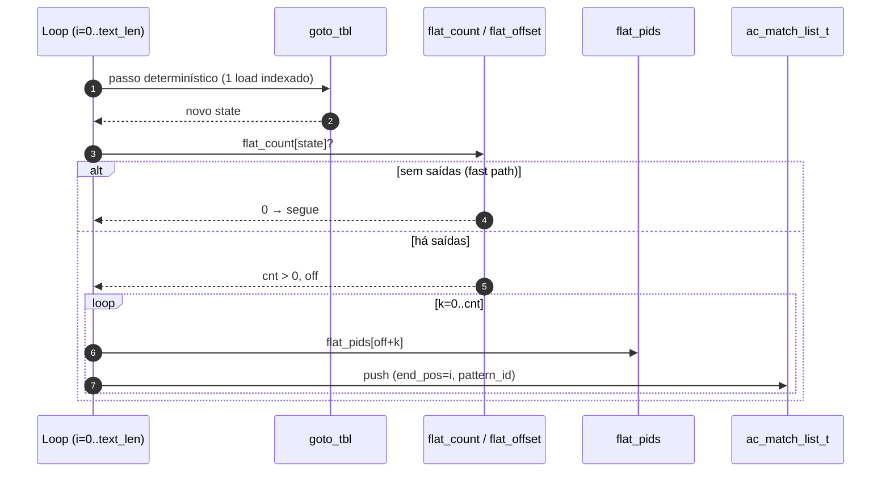

# Searcher `sequential_flat`

Variante **single-thread** do Aho–Corasick que substitui a emissão por
cadeia de `dict_suffix` por uma leitura linear de uma **tabela achatada
de pattern_ids por estado** pré-computada na construção do autômato
(idea 5 do roadmap de paralelismo). É a forma mais simples de exibir
o ganho da transformação de layout em isolamento, sem mistura com
threading.

- Fonte: [`src/searchers/sequential_flat.c`](../../src/searchers/sequential_flat.c)
- Registro: `__attribute__((constructor)) seq_flat_register()`
- Descrição: *Sequential AC scan reading the flat output table (idea 5)*
- Notas do TCC: [`../../../tcc_notes/sections/notes/methodology.md`](../../../tcc_notes/sections/notes/methodology.md) e [`../../../tcc_notes/sections/notes/results.md`](../../../tcc_notes/sections/notes/results.md)
- Layout transformado: [`../architecture/flat-outputs.md`](../architecture/flat-outputs.md)

## Quando usar

- Para **isolar** o ganho da idea 5 em medições single-thread (sem
  ruído de criação de threads / merge).
- Como **baseline migrado**: qualquer variante paralela que adote o
  layout deve recuperar o speedup deste em T=1.
- Em corpus pequenos onde o particionamento perde para a sequencial,
  mas o flat ainda vale (a versão paralela faz `fallback` para esta
  rotina via `ac_searcher_find("sequential_flat")`).

## Algoritmo, em uma frase

Idêntico ao [`sequential`](sequential.md), exceto que a emissão lê
diretamente `flat_pids[flat_offset[state] .. + flat_count[state])` em
vez de caminhar duas cadeias (own_out_head + dict_suffix + outputs).

## Estruturas consumidas

Da `ac_automaton_t` (read-only):

- `goto_tbl[state * 256 + byte]` — próxima transição (idêntico ao
  `sequential`).
- `flat_offset[state]` — posição inicial dos pids deste estado em
  `flat_pids[]`.
- `flat_count[state]` — quantos pids emitir.
- `flat_pids[]` — arena densa de `int32_t` com os pattern_ids,
  preenchida na ordem canônica (próprias saídas, depois ancestrais
  por `dict_suffix`).

A construção dessas três arenas está em
[`../architecture/flat-outputs.md`](../architecture/flat-outputs.md).
Os campos antigos (`own_out_head`, `dict_suffix`, `outputs`) continuam
presentes no struct para que searchers que ainda usam o chain-walk
funcionem inalterados — o layout é **estritamente aditivo**.

## Fluxo do searcher

```mermaid
flowchart TD
    A[Início: state = 0, i = 0] --> B{i < text_len?}
    B -- não --> Z[Retorna AC_OK]
    B -- sim --> C[c = text&#91;i&#93;]
    C --> D[state = goto_tbl&#91;state*256 + c&#93;]
    D --> E{flat_count&#91;state&#93; > 0?}
    E -- não --> F[i++]
    E -- sim --> G[off = flat_offset&#91;state&#93;<br/>cnt = flat_count&#91;state&#93;]
    G --> H[Para k em 0..cnt:<br/>emite (end=i, pat=flat_pids&#91;off+k&#93;)]
    H --> F
    F --> B
```

## Invariantes em que o searcher se apoia

1. **Autômato imutável após `ac_automaton_build`** — `flat_offset`,
   `flat_count` e `flat_pids` são populados no fim do build e nunca
   mais escritos. Igual aos campos antigos do struct.
2. **Multiset preservado** — `flat_pids[s]` contém *exatamente* o
   mesmo multiset de pattern_ids que o chain walk emitiria em `s`,
   na mesma ordem (próprias antes; depois cada ancestral subindo por
   `dict_suffix`). Logo o resultado é bit-equivalente ao
   `sequential` após `ac_match_list_sort`.
3. **`flat_count[s] == 0`** implica que o estado é não-emissor;
   `flat_offset[s]` ainda é definido (igual ao total acumulado até
   `s`) mas não é lido. O *fast path* via `AC_UNLIKELY` é o mesmo do
   chain walk, só com uma leitura no lugar de duas.

## Caminho do hot loop



A diferença observável vs. `sequential`:

- O chain walk paga **duas cargas dependentes** por match — uma em
  `dict_suffix[l]` (acesso aleatório em `int32_t[num_states]`) e uma
  em `outputs[o].next` (acesso aleatório em arena de saídas). Em
  dicionários grandes, ambos os arrays escapam de L2 e cada match
  vira pointer-chasing frio.
- O flat walk faz **uma carga em `flat_count[state]`** (mesma linha
  de cache que `flat_offset`, já indexada por `state`) e depois lê
  `flat_pids[off..off+cnt)` em ordem contígua — comportamento ideal
  para o prefetcher de hardware.

## Garantias

- **Determinístico**: igual ao `sequential`, mesma multiplicidade e
  mesmo `end_pos`.
- **Sem alocação fora do `ac_match_list_t`**.
- **Não escreve no autômato**: respeita read-only — qualquer searcher
  paralelo pode reaproveitar essa rotina como fallback de input
  pequeno (e o [`pthread_chunked_flat`](pthread_chunked_flat.md) o faz).

## Como o harness chama

```text
seq_flat_search(aut, text, text_len, cfg /* ignorado */,
                out_matches,
                out_thread_metrics → NULL,
                out_num_thread_metrics → 0)
```

`ac_searcher_config_t::num_threads` é ignorado.

## Complexidade

- **Tempo**: `O(|texto| + |saídas reportadas|)` — mesma classe que o
  chain walk, com **constante menor** (uma carga indexada de
  `flat_count` por byte em vez de duas leituras + branch).
- **Memória adicional durante a busca**: `O(|saídas reportadas|)`
  na `ac_match_list_t`. Nenhum trabalho extra de construção em runtime
  — toda a tabela já está pronta.

## Headline benchmark

Ambiente: 12-core x86_64, kernel 6.17, `-O3 -march=native`.

Corpus: `data/simplewiki.txt` (~1.2 GiB) com dicionário Snort
(`data/patterns_snort.txt`, 4188 padrões, 55479 estados).

| Searcher          | T  | Throughput (MB/s) | Mean (ms) | Build (ms) |
|-------------------|----|-------------------|-----------|------------|
| `sequential`      | 1  | 192.82            | 6308.8    | 55.8       |
| `sequential_flat` | 1  | **244.16**        | 4982.3    | 50.3       |

Speedup do flat sobre o chain-walk em **single-thread**: **1.27×**.
O ganho cresce com o tamanho do dicionário (mais misses em
`dict_suffix` no chain walk).

## Próximos passos / leituras relacionadas

- Para entender o pass adicional na construção, consulte
  [`../architecture/flat-outputs.md`](../architecture/flat-outputs.md)
  e a seção "Idea 5" em
  [`../architecture/automaton.md`](../architecture/automaton.md).
- Para a variante paralela combinada, consulte
  [`pthread_chunked_flat.md`](pthread_chunked_flat.md).
- Para o veredito consolidado da idea 5 no TCC, consulte
  [`../../../tcc_notes/sections/notes/conclusion.md`](../../../tcc_notes/sections/notes/conclusion.md).
